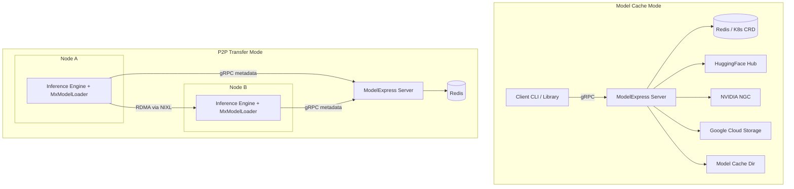
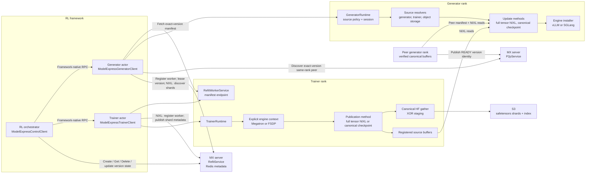
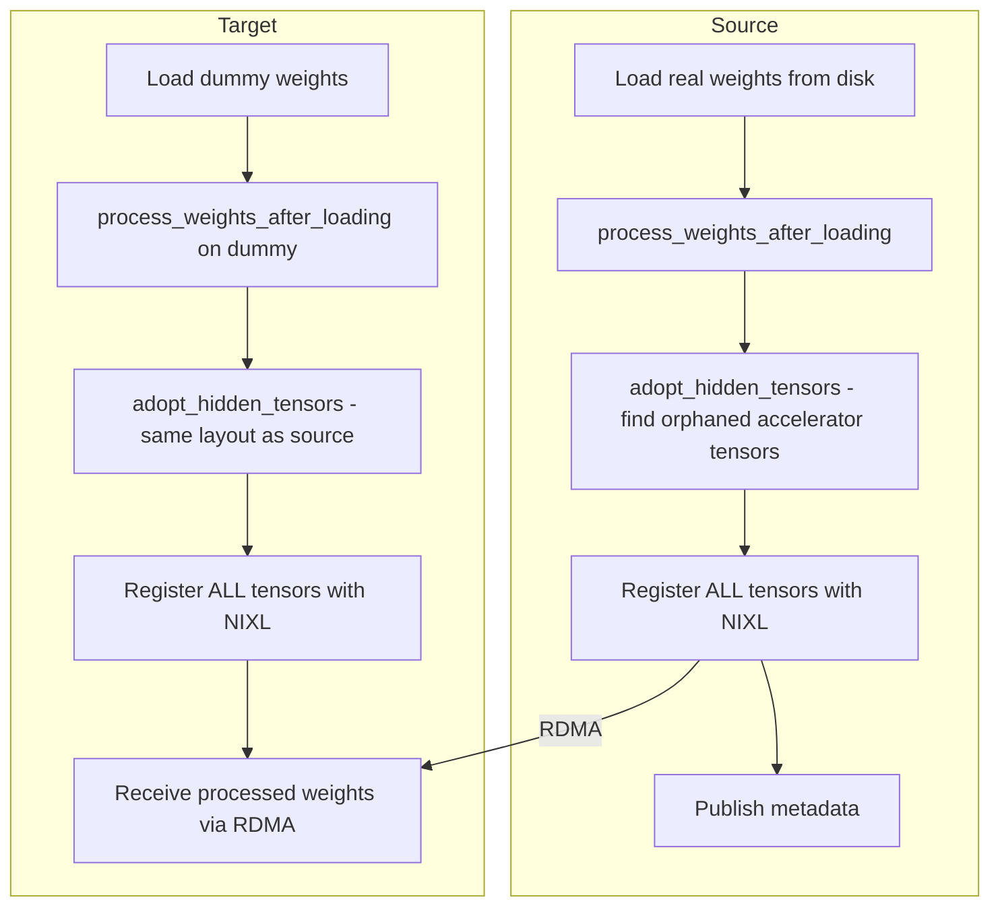

<!--
SPDX-FileCopyrightText: Copyright (c) 2025-2026 NVIDIA CORPORATION & AFFILIATES. All rights reserved.
SPDX-License-Identifier: Apache-2.0
-->

# ModelExpress architecture and internals

This is the implementation reference for the ModelExpress codebase. Start with the [documentation hub](README.md) or [Choose a ModelExpress path](guides/choose-a-path.md) for deployment questions. Use [Configuration](CONFIGURATION.md) for current defaults, [Integrations](integrations/README.md) for runtime setup, and [Troubleshooting](TROUBLESHOOTING.md) for operational symptoms. For contribution guidelines and dev setup, see [`CONTRIBUTING.md`](../CONTRIBUTING.md). For CLI usage, see [`CLI.md`](CLI.md). For GCS provider internals, see [`GCS_PROVIDER.md`](GCS_PROVIDER.md).

## Project Overview

ModelExpress is a Rust-based model cache management service and GPU-to-GPU model weight transfer system. It serves two roles:

- **Model Cache Service** - A sidecar alongside inference solutions (vLLM, SGLang, NVIDIA Dynamo) that accelerates model downloads from HuggingFace, NGC, and GCS. Model lifecycle state lives in a distributed registry — Redis or Kubernetes CRDs (`ModelCacheEntry`), selected via `MX_METADATA_BACKEND` — so multiple server replicas can coordinate without a shared-filesystem database. LRU cache eviction runs off the same registry.
- **P2P Weight Transfer** - GPU-to-GPU model weight transfers between inference replicas using NVIDIA NIXL over RDMA/InfiniBand, enabling ~15-second transfers for 681GB models. The Python client includes engine adapters for vLLM and SGLang.

### Current Status

| Model | Status | Transfer Time | Notes |
|-------|--------|---------------|-------|
| DeepSeek-V3 (671B, FP8) | Working | ~15s | 681GB across 8 GPUs @ ~45 Gbps per link |
| Llama 3.3 70B | Working | ~5s | 140GB across 8 GPUs @ ~28 Gbps per link |

## Architecture



### Components

| Component | Language | Location | Purpose |
|-----------|----------|----------|---------|
| Server | Rust | `modelexpress_server/` | gRPC server: model downloads, cache eviction, P2P coordination |
| Rust Client | Rust | `modelexpress_client/src/` | Client library and CLI tool |
| Python Client | Python | `modelexpress_client/python/` | Inference engine loaders, NIXL transfer manager, gRPC client |
| Common | Rust | `modelexpress_common/` | Protobuf definitions, shared types, provider trait, config |
| Workspace Tests | Rust | `workspace-tests/` | Integration tests and Criterion benchmarks |

## Repository Structure

```text
ModelExpress/
├── Cargo.toml                          # Workspace root (4 members)
├── Cargo.lock
├── docker/
│   ├── Dockerfile                      # Multi-stage production image
│   ├── Dockerfile.client-wheel         # Builds Python client wheels + sdist
│   └── docker-compose.yml              # Single-service dev setup
├── run_integration_tests.sh            # Integration test runner
├── test_client.sh                      # Client test script
├── test_grpc_transfer_k8s.sh           # K8s gRPC transfer test
├── deny.toml                           # cargo-deny config
├── rust-toolchain.toml                 # Rust version pinning
├── rustfmt.toml                        # Formatting config
├── modelexpress-cli-completion.bash    # Shell completions
│
├── modelexpress_server/
│   ├── Cargo.toml
│   └── src/
│       ├── main.rs                     # Server startup, service registration
│       ├── lib.rs                      # Module exports
│       ├── config.rs                   # ServerConfig, layered loading, validation
│       ├── backend_config.rs           # Shared BackendConfig (Redis / K8s) + env parsing
│       ├── cache.rs                    # CacheEvictionService, LRU policy
│       ├── services.rs                 # Health, API, Model gRPC services + ModelDownloadTracker
│       ├── metrics.rs                   # Prometheus registry, mx_build_info, encoding
│       ├── metrics/
│       │   ├── exposition.rs            # HTTP/1.1 /metrics listener (separate port)
│       │   ├── buckets.rs               # Shared histogram bucket boundaries
│       │   ├── grpc.rs                  # Per-RPC tower layer; in-handler outcomes
│       │   ├── backend.rs               # Backend op counters and latency
│       │   ├── registry.rs              # Download claim, lease and status transitions
│       │   └── cache.rs                 # Eviction reasons and refreshed gauges
│       ├── p2p/
│       │   ├── state.rs                # P2pStateManager wrapper
│       │   ├── service.rs              # P2P gRPC service implementation
│       │   ├── source_identity.rs      # SHA256-based mx_source_id computation
│       │   ├── reaper.rs               # Server-side stale source detection and GC
│       │   ├── k8s_types.rs            # P2P CRD type definitions (ModelMetadata)
│       │   ├── backend.rs              # MetadataBackend trait + types
│       │   └── backend/
│       │       ├── redis.rs            # P2P Redis backend
│       │       ├── kubernetes.rs       # P2P Kubernetes CRD backend
│       │       └── instrumented.rs     # Metrics decorator over MetadataBackend
│       ├── refit.rs                     # Refit module exports
│       ├── refit/
│       │   ├── service.rs               # Backend-neutral Refit gRPC service
│       │   ├── backend.rs               # RefitBackend contract and factory
│       │   └── backend/
│       │       ├── redis.rs             # Redis backend and atomic Lua scripts
│       │       └── instrumented.rs      # Metrics decorator over RefitBackend
│       ├── registry/
│       │   ├── state.rs                # RegistryManager wrapper
│       │   ├── stats_refresh.rs        # Background gauge refresh (own interval)
│       │   ├── backend.rs              # RegistryBackend trait + ModelRecord
│       │   ├── entry_key.rs            # EntryKey: model + revision + weight mode
│       │   ├── k8s_types.rs            # ModelCacheEntry CRD type
│       │   └── backend/
│       │       ├── redis.rs            # Redis registry backend
│       │       ├── kubernetes.rs       # K8s ModelCacheEntry registry backend
│       │       └── instrumented.rs     # Metrics decorator over RegistryBackend
│       └── bin/
│           └── config_gen.rs           # Config file generator/migrator
│
├── modelexpress_client/
│   ├── Cargo.toml
│   └── src/
│       ├── lib.rs                      # Client struct, public API
│       └── bin/
│           ├── cli.rs                  # CLI entry point (modelexpress-cli)
│           ├── test_client.rs          # Concurrent/single download tests
│           ├── fallback_test.rs        # Provider fallback tests
│           └── modules/
│               ├── args.rs             # CLI args (Cli struct, embeds ClientArgs)
│               ├── handlers.rs         # CLI command handlers
│               ├── output.rs           # Output formatting (human, JSON, JSON-pretty)
│               └── payload.rs          # JSON payload reader (inline, file, stdin)
│
├── modelexpress_client/python/
│   ├── pyproject.toml                  # Python package config
│   ├── generate_proto.sh               # Proto stub generation script
│   └── modelexpress/
│       ├── __init__.py                 # Package init, vLLM loader auto-registration
│       ├── client.py                   # MxClient gRPC client
│       ├── nixl_transfer.py            # NixlTransferManager
│       ├── refit/                      # Engine-agnostic live-refit primitives
│       │   ├── __init__.py             # Public refit exports
│       │   ├── timing.py               # Structured refit stage timing
│       │   └── reshard/                # Geometry capture, planning, rendezvous and transport
│       ├── refit_timing.py             # Compatibility shim for refit.timing
│       ├── source_selection.py         # P2P source-ordering policies (random, rendezvous_hash)
│       ├── metrics.py                   # Opt-in Prometheus metrics collector (source-selection group today)
│       ├── gds_transfer.py             # GPUDirect Storage transfer support
│       ├── gds_loader.py               # GDS model loader
│       ├── adapter.py                  # EngineAdapter contract and strategy errors
│       ├── vllm_loader.py              # Compatibility shim for engines.vllm.loader
│       ├── metadata/                   # Metadata clients, publishing, heartbeat, worker manifest service
│       │   ├── __init__.py
│       │   ├── artifact_lifecycle.py   # Engine-agnostic cache-artifact lifecycle
│       │   ├── artifact_transfer.py    # Tar/NIXL artifact transfer primitives
│       │   ├── publish.py              # Source identity + metadata publication
│       │   ├── publisher.py            # Source publication and heartbeat signaling
│       │   ├── worker_server.py        # WorkerGrpcServer (P2P tensor/artifact manifests)
│       │   ├── source_id.py            # Python mx_source_id computation
│       │   ├── client_factory.py       # Selects central vs k8s-service metadata client
│       │   └── k8s_service_client.py   # Decentralized k8s-service metadata client
│       ├── load_strategy/              # Loading strategy chain
│       │   ├── __init__.py             # LoadStrategyChain.run()
│       │   ├── context.py              # LoadContext and LoadResult
│       │   ├── base.py                 # LoadStrategy ABC and shared helpers
│       │   ├── rdma_strategy.py        # RdmaStrategy (P2P GPU transfer via NIXL)
│       │   ├── server_cache_strategy.py # ServerCacheStrategy (weights from MX Server)
│       │   ├── instant_tensor_strategy.py # InstantTensorStrategy (fast local safetensors)
│       │   ├── model_streamer_strategy.py # ModelStreamerStrategy (S3/GCS/Azure/local)
│       │   ├── gds_strategy.py         # GdsStrategy (GPUDirect Storage)
│       │   └── default_strategy.py     # DefaultStrategy (engine-native fallback)
│       ├── engines/
│       │   ├── vllm/                   # vLLM integration
│       │   │   ├── __init__.py         # vLLM loader registration
│       │   │   ├── adapter.py          # VllmAdapter and context builder
│       │   │   ├── loader.py           # MxModelLoader implementation
│       │   │   ├── mdl.py              # Compatibility shim for vLLM refit
│       │   │   └── refit/
│       │   │       ├── __init__.py     # vLLM refit exports
│       │   │       └── installer.py    # Mapped Direct Load installer
│       │   └── sglang/                 # SGLang integration
│       │       ├── __init__.py
│       │       ├── adapter.py          # SglangAdapter and context builder
│       │       └── loader.py           # MxModelLoader for remote_instance backend
│       ├── tensor_utils.py             # Tensor collection, checksums, storage views
│       ├── transfer_safety.py          # Model feature detection for the P2P gate
│       ├── rank_utils.py               # Rank detection utilities
│       ├── vllm_worker.py              # Compatibility worker for older manual registration
│       ├── types.py                    # TensorDescriptor, WorkerMetadata dataclasses
│       ├── p2p_pb2.py                  # Generated protobuf stubs
│       └── p2p_pb2_grpc.py             # Generated gRPC stubs
│
├── modelexpress_common/
│   ├── Cargo.toml
│   ├── build.rs                        # tonic-build: compiles all 4 proto files
│   ├── proto/
│   │   ├── health.proto                # HealthService
│   │   ├── api.proto                   # ApiService
│   │   ├── model.proto                 # ModelService
│   │   └── p2p.proto                   # P2pService
│   └── src/
│       ├── lib.rs                      # Module exports, gRPC stubs, type conversions
│       ├── cache.rs                    # CacheEvictionConfig, LruConfig, DurationConfig
│       ├── client_config.rs            # ClientConfig, ClientArgs (shared CLI args)
│       ├── config.rs                   # Config trait utilities
│       ├── download.rs                 # Download orchestration (smart-fallback, direct, server-only)
│       ├── models.rs                   # Status, ModelProvider, ModelStatus, ModelStatusResponse
│       ├── providers.rs                # ModelProviderTrait definition, re-exports
│       └── providers/
│           ├── gcs.rs                  # GcsProvider implementation
│           ├── gcs/                    # GCS manifest, cache layout, locking, download helpers
│           ├── huggingface.rs          # HuggingFaceProvider implementation
│           └── ngc.rs                  # NgcProvider implementation
│
├── workspace-tests/
│   ├── Cargo.toml
│   ├── tests/
│   │   └── integration_tests.rs        # Health, ping, download, fallback tests
│   └── benches/
│       └── performance.rs              # Criterion: DB ops, serialization benchmarks
│
├── helm/
│   ├── Chart.yaml                      # v0.2.2
│   ├── deploy.sh                       # Deploy script (microk8s/kubectl auto-detect)
│   ├── values.yaml                     # Default (1 replica, 10Gi PVC)
│   ├── values-development.yaml         # Dev (debug, 512Mi)
│   ├── values-production.yaml          # Prod (3 replicas, 2Gi, ingress)
│   ├── values-local-storage.yaml       # Test (no PVC, emptyDir)
│   └── templates/
│       ├── deployment.yaml
│       ├── service.yaml
│       ├── pvc.yaml
│       ├── ingress.yaml
│       └── serviceaccount.yaml
│
├── examples/
│   ├── p2p_transfer_k8s/               # GPU-to-GPU weight transfer example
│   │   ├── README.md
│   │   ├── model-download.yaml         # Model weights download job
│   │   ├── server/
│   │   │   ├── kubernetes_backend/     # CRD-based metadata (crd, rbac, server)
│   │   │   └── redis_backend/          # Redis-based metadata (redis, server)
│   │   └── client/
│   │       ├── vllm/
│   │       │   ├── Dockerfile          # vLLM + ModelExpress client image
│   │       │   ├── vllm-single-node.yaml  # TP-only (DeepSeek-V4-Pro)
│   │       │   └── vllm-multi-node.yaml   # TP+PP (DeepSeek-V4-Pro, 2 nodes)
│   │       └── sglang/
│   │           ├── Dockerfile          # SGLang + ModelExpress client image
│   │           └── sglang-single-node-p2p.yaml
│   ├── model_streamer_k8s/             # ModelStreamer startup examples
│   │   ├── README.md
│   │   └── client/
│   │       └── vllm/
│   │           ├── README.md
│   │           ├── vllm-single-node-streamer-azure.yaml
│   │           ├── vllm-single-node-streamer-s3.yaml
│   │           └── vllm-single-node-streamer-local.yaml
│   ├── crds.yaml                       # ModelMetadata + ModelCacheEntry CRDs (cluster-admin)
│   ├── dynamo_model_cache_k8s/         # Dynamo model-cache serving example
│   │   ├── README.md
│   │   └── agg.yaml
│   └── dynamo_p2p_transfer_k8s/        # Dynamo DGD with P2P weight transfer
│       ├── Dockerfile                   # dynamo vllm-runtime + MX client
│       ├── README.md
│       └── vllm/
│           ├── rbac-modelmetadata.yaml  # ServiceAccount + Role + RoleBinding
│           └── vllm-multi-node-aggregated.yaml  # DGD: MX server + Frontend + VllmWorker
│
├── docs/
│   ├── ARCHITECTURE.md                 # Architecture reference
│   ├── CLI.md                          # CLI tool documentation
│   ├── DEPLOYMENT.md                   # Deployment and configuration guide
│   └── metadata.md                     # Metadata storage and coordination protocol
│
├── .devcontainer/
│   ├── devcontainer.json               # VSCode config: rust-analyzer, port 8001
│   └── Dockerfile                      # Ubuntu 24.04 dev env
│
├── AGENTS.md                           # Always-on rules for all AI coding agents (Codex, Cursor, Copilot, Claude)
├── CLAUDE.md                           # Claude Code entry point: imports AGENTS.md
│
├── .agents/
│   └── skills/                         # Shared on-demand procedures (SKILL.md), read by Codex and Cursor
│       ├── add-cli-argument/
│       ├── add-grpc-service/
│       ├── bump-version/
│       └── dco/
│
├── .claude/
│   ├── settings.json                   # Claude Code permissions
│   └── skills/                         # Symlinks into .agents/skills/ so Claude Code sees the same skills
│
├── .github/
│   ├── copilot-instructions.md         # Copilot Chat pointer to AGENTS.md
│   ├── dco.yml                         # DCO enforcement
│   └── workflows/
│       ├── ci.yml                      # CI pipeline
│       └── codeql.yml                  # Security scanning
│
├── .pre-commit-config.yaml             # Pre-commit hooks config
└── .coderabbit.yaml                    # CodeRabbit review config
```

## Workspace and Crate Structure

| Crate | Package Name | Type | Binary Targets |
|-------|-------------|------|----------------|
| `modelexpress_server` | `modelexpress-server` | lib + bin | `modelexpress-server`, `config_gen` |
| `modelexpress_client` | `modelexpress-client` | lib + bin | `modelexpress-cli`, `test_client`, `fallback_test` |
| `modelexpress_common` | `modelexpress-common` | lib | (none) |
| `workspace-tests` | `workspace-tests` | test + bench | (integration tests, criterion benchmarks) |

All cargo dependencies are declared in the root `Cargo.toml`. Sub-crates use workspace dependencies exclusively.

## gRPC Services

Six proto files define the server's gRPC services, all compiled via `tonic-build` in `modelexpress_common/build.rs`:

### health.proto - HealthService

| RPC | Request | Response | Purpose |
|-----|---------|----------|---------|
| `GetHealth` | `HealthRequest` | `HealthResponse` | Server version, status, uptime |

### api.proto - ApiService

| RPC | Request | Response | Purpose |
|-----|---------|----------|---------|
| `SendRequest` | `ApiRequest` | `ApiResponse` | Generic API (e.g., "ping" -> "pong") |

### model.proto - ModelService

| RPC | Request | Response | Purpose |
|-----|---------|----------|---------|
| `EnsureModelDownloaded` | `ModelDownloadRequest` | stream `ModelStatusUpdate` | Trigger download, stream progress |
| `StreamModelFiles` | `ModelFilesRequest` | stream `FileChunk` | Stream model file contents (1MB chunks) |
| `ListModelFiles` | `ModelFilesRequest` | `ModelFileList` | List files with sizes |
| `DeleteModel` | `DeleteModelRequest` | `DeleteModelResponse` | Remove a model's records from the registry (used by `model clear`) |

Key message types: `ModelProvider` (HuggingFace, NGC, GCS), `ModelStatus` (Downloading, Downloaded, Error), `ModelStatusUpdate`, `FileChunk`.

`EnsureModelDownloaded` verifies that a `DOWNLOADED` registry record still has its files on disk before honoring it as a cache hit. If the files are missing (for example after a `model clear` that only removed local storage), the stale record is deleted and the download is re-claimed so the model is actually re-fetched rather than returning a false success.

#### Pinned revisions

`ModelDownloadRequest` and `ModelFilesRequest` carry an optional `revision` (a branch, tag, or commit SHA); `ModelStatusUpdate` reports the `resolved_revision` the request landed on. Providers without a revision concept (NGC, GCS) reject a set `revision` and report none.

The server resolves the revision to an immutable commit **before** claiming the download lease, then pins every Hub file request to that commit, so a tag that moves mid-download cannot mix commits into one snapshot. A requested revision that does not exist fails the request; it never falls back to the default revision. An unpinned request still resolves the default revision to a commit SHA and reports it, so callers always learn the exact commit they got. If the Hub is unreachable while resolving an *unpinned* request, the server falls back to the snapshot already in its cache, which keeps cache hits working during a Hub outage.

`StreamModelFiles` and `ListModelFiles` resolve a requested revision against the local cache only — the model is already downloaded, so serving it must not depend on Hub reachability.

When a no-shared-storage client installs a snapshot over the file stream, it also writes the provider's local revision bookkeeping (`ModelProviderTrait::record_local_revision`; for Hugging Face, `refs/<requested-revision>`). Without it the files would be on disk but `huggingface_hub` could not resolve them by branch or tag under `HF_HUB_OFFLINE=1`.

#### Registry entry keys

Registry backends key every record, lease, and claim on one string. That key is an [`EntryKey`](../modelexpress_server/src/registry/entry_key.rs) encoding of `model_name` + resolved revision + weight mode. This is what keeps two revisions of one model from sharing a lease (and coalescing onto each other's download), and what keeps a metadata-only download from satisfying a later full-weight request with a weightless snapshot.

An unpinned, full-weight entry encodes to the bare model name, so records written before revisions existed keep parsing and providers without a revision concept keep the keys they have always used. Anything else encodes as `mx1:<revision>:<flags>:<model_name>`. The model name goes last because it is the only field with no character restrictions — a GCS object path accepts almost any byte, so a name containing the separator must not be able to impersonate the other fields and aim a delete at the wrong model.

Cache eviction parses the key back to delete the right snapshot. It keeps the files while another entry still references the same commit, treating a revisionless entry as covering every snapshot of its model. When the evicted entry is the last one for its model the whole repository directory goes, so a snapshot kept alive by an earlier shared-file decision cannot outlive the last record pointing at it. Hugging Face snapshot entries are symlinks into `blobs/`, so a per-revision delete also reclaims the blobs no surviving snapshot references — otherwise it would free almost no disk.

### p2p.proto - P2pService

| RPC | Request | Response | Purpose |
|-----|---------|----------|---------|
| `PublishMetadata` | `PublishMetadataRequest` | `PublishMetadataResponse` | Source publishes worker metadata (identity + tensors + backend metadata) |
| `ListSources` | `ListSourcesRequest` | `ListSourcesResponse` | Lightweight listing of available source workers (no tensor data) |
| `GetMetadata` | `GetMetadataRequest` | `GetMetadataResponse` | Fetch full tensor metadata for one specific worker (MB-scale, on demand) |
| `UpdateStatus` | `UpdateStatusRequest` | `UpdateStatusResponse` | Update per-worker lifecycle status (Initializing/Ready/Stale) |

Key message types: `SourceIdentity` (all fields affecting tensor layout compatibility and `mx_source_id`), `WorkerMetadata` (rank, runtime `accelerator`, oneof backend_metadata, tensors, status, P2P endpoint fields), `TensorDescriptor` (name, addr, size, device_id, dtype), `SourceInstanceRef` (lightweight worker reference for listing, including runtime `accelerator` for pre-fetch compatibility filtering).

### p2p.proto - WorkerService (P2P, opt-in)

| RPC | Request | Response | Purpose |
|-----|---------|----------|---------|
| `GetTensorManifest` | `GetTensorManifestRequest` | `GetTensorManifestResponse` | Fetch tensor descriptors directly from a source worker |
| `GetArtifactManifestHeader` | `GetArtifactManifestHeaderRequest` | `GetArtifactManifestHeaderResponse` | Fetch artifact identity, counts, file table, and worker endpoints |
| `GetArtifactManifestChunks` | `GetArtifactManifestChunksRequest` | `GetArtifactManifestChunksResponse` | Fetch artifact chunk metadata pages by `chunk_index` |
| `PrepareArtifactChunk` | `PrepareArtifactChunkRequest` | `PrepareArtifactChunkResponse` | Read one artifact range into source registered DRAM and return a NIXL descriptor lease |
| `ReleaseArtifactChunk` | `ReleaseArtifactChunkRequest` | `ReleaseArtifactChunkResponse` | Release a prepared artifact chunk lease |

Per-worker gRPC service started when `MX_P2P_METADATA=1`, or unconditionally when using a decentralized metadata backend (the backend's client sets `REQUIRES_P2P_METADATA = True` and the env var is ignored). Targets call this instead of fetching tensor descriptors or artifact manifest metadata from the central server. `GetTensorManifestResponse` carries the source worker's runtime `accelerator` value so decentralized targets can apply the same compatibility filter as central metadata mode. Artifact byte transfer still uses NIXL; `PrepareArtifactChunk` only exposes a source-side registered DRAM range for one sealed artifact chunk. `GetTensorManifest` validates both `mx_source_id` and the selected runtime `worker_id` to catch stale discovery records whose endpoint has been reused by a new process. The `worker_id` handshake fields are optional for rolling-upgrade compatibility; generation validation takes effect when the source supports them.

See [`metadata.md`](metadata.md) for the full metadata architecture including storage schemas and coordination protocol.

### refit.proto - RefitService (Redis only)

`RefitService` is a new RL-specific control plane. It does not reuse or modify the
legacy `WeightSyncService`. The initial slice stores worker registrations,
immutable weight versions, and compact physical shard publications in Redis.
NIXL manifest endpoints belong to their physical worker shards; a typed object
storage source belongs directly to its durable `WeightVersion`. The protocol
can identify S3, Azure Blob Storage, or GCS, while this initial implementation
accepts only S3. On the NIXL path, weight bytes and full tensor manifests remain
on trainer workers. On the S3 path, rank zero uploads the version's global index
after every trainer rank has uploaded its owned shard. `XOR_DELTA` versions use
compressed XOR shards; `FULL_HF_CHECKPOINT` versions use native Hugging Face
safetensor shards and omit `base_version_id`. Frameworks own
tensor gathering, Hugging Face conversion, and bucketization, then pass a lazy
canonical bucket stream to the trainer client, which owns delta processing,
full-checkpoint serialization, and S3 shard construction.
Full-checkpoint staging uses the same bounded worker-pool pattern as delta
staging to update the rank-local snapshot directly with immutable CPU tensors.
`publish()` groups that snapshot into safetensors objects capped by
`MX_REFIT_FULL_CHECKPOINT_BATCH_BYTES` (4 GiB by default) and uploads the
rank-local objects concurrently. A tensor larger than the cap occupies its own
object. The trainer does not materialize a temporary HF checkpoint on disk.
During framework initialization, the same bucket stream seeds only that rank's
owned seed-checkpoint tensors through direct, concurrent
`prepare_delta_base()` bucket reads. The first real delta stage uses the
prepared snapshot without checkpoint I/O.
Each canonical S3 version owns an exact caller-supplied `object_storage.uri`
under the configured `uri_prefix`. That URI names the global index; delta shards
or full-checkpoint safetensors objects are stored as siblings. A delta index's
`compression_format` selects the receiver's decompressor. The current
implementation supports Zstandard. Unknown compression formats are rejected
before shard download. Full versions use a standard safetensors index, carry
optional per-tensor Adler-32 checksums under tensor-name keys in shard metadata
when the index declares `checksum_format="adler32"`, and reset the exact base
for later deltas.
Canonical S3 versions are retained for rollout fault recovery. Trainer
processes keep only the current base snapshot; older
immutable S3 objects are governed by external bucket lifecycle policy.

#### RL refit client architecture

The RL framework orchestrator calls only the public
`ModelExpressControlClient`. Framework-native RPCs invoke rank-local trainer and
generator clients inside their existing actors. Those clients use internal MX
control-plane and worker APIs; tensor bytes never pass through `RefitService`.



`RefitService` is the central metadata service defined by `refit.proto`. It
coordinates immutable versions, worker registrations, shard advertisements,
and leases, but it does not discover engine tensor layouts or transfer weights.
For NIXL, `RefitWorkerService` is the trainer-local manifest endpoint.
The manifest is an opaque description of the exact published source buffers;
the generator uses it to compile and validate its receiver-local transfer plan.
For S3, `WeightVersion.object_storage` identifies the storage type and global
`model.safetensors.index.json` URI directly; the server validates only this
typed location and does not contact S3.
Trainer integrations provide the matching `ObjectStorageConfig` through
`ModelExpressTrainerConfig.object_storage`; the initial implementation rejects
providers other than S3 before creating the storage client.

The synchronous generator client returns a staged handle only after transfer
and verification finish. That handle owns the version lease through graph-safe
installation; applying the weights or releasing an unapplied handle ends the
lease. There is no separate asynchronous wait or unimplemented direct-install
API.

The initial worker manifest channel uses plaintext gRPC and does not authenticate
the publishing worker. Manifest digests detect corruption but do not establish
source identity. Deploy RL refit only on a trusted, network-isolated cluster and
prevent untrusted clients from reaching MX server and worker gRPC endpoints.
Transport authentication and TLS require a separate protocol and deployment
design; they are not provided by this implementation.

`GeneratorRuntime` composes three independent seams. Source resolvers discover
candidate locations without moving bytes; update methods transfer and verify a
typed artifact without mutating the live engine; the engine installer commits
that artifact at the caller's safe point. Source fallback and retry limits live
in the planner/session rather than in engine integrations.

- `nixl_staged_transfer.py` owns exact-manifest decoding, transfer planning,
  reusable registered buffers, NIXL reads, transforms, and digest verification.
- `inference/checkpoint_store.py` owns the host-local immutable lineage layout,
  locking, temporary-directory promotion, atomic JSON persistence, artifact
  fingerprints, and activation state.
- `inference/receiver.py` owns canonical S3 downloads, safetensors validation,
  and XOR reconstruction into derived checkpoints.
- `inference/engines/vllm/installer.py` owns vLLM load-layout capture and
  graph-safe installation through vLLM's layerwise reload and post-load path.
- `inference/engines/sglang/installer.py` reloads a prepared canonical checkpoint
  through SGLang's native safetensors loader.

The corresponding trainer composition is owned by `TrainerRuntime`. Public
`FSDPTrainerContext` and `MegatronTrainerContext` select only engine capture;
full-tensor NIXL and canonical-checkpoint object-storage publication remain separate
method implementations. This keeps transport, payload preparation, engine
geometry, and framework orchestration independently replaceable.

| RPC | Request | Response | Purpose |
|-----|---------|----------|---------|
| `RegisterWorker` | `RegisterWorkerRequest` | `RegisterWorkerResponse` | Register or refresh one TTL-bound worker process |
| `CreateWeightVersion` | `CreateWeightVersionRequest` | `CreateWeightVersionResponse` | Idempotently create one immutable `STAGING` or already-published `READY` version |
| `GetWeightVersion` | `GetWeightVersionRequest` | `GetWeightVersionResponse` | Read the version and its lifecycle state |
| `DeleteWeightVersion` | `DeleteWeightVersionRequest` | `DeleteWeightVersionResponse` | Cancel a `STAGING` version or move a `READY` version to `RELEASING` for retirement |
| `UpdateWeightVersionState` | `UpdateWeightVersionStateRequest` | `UpdateWeightVersionStateResponse` | Explicitly update lifecycle state, including S3 `STAGING` to `READY` |
| `CreateWeightVersionShard` | `CreateWeightVersionShardRequest` | `CreateWeightVersionShardResponse` | Publish one worker manifest for a required source slot |
| `ListWeightVersionShards` | `ListWeightVersionShardsRequest` | `ListWeightVersionShardsResponse` | List the version's physical source publications |
| `DeleteWeightVersionShard` | `DeleteWeightVersionShardRequest` | `DeleteWeightVersionShardResponse` | Evict one source shard after release when no lease protects the version |
| `RegisterVersionLease` | `RegisterVersionLeaseRequest` | `RegisterVersionLeaseResponse` | Acquire or renew protection while installing a version |
| `DeleteVersionLease` | `DeleteVersionLeaseRequest` | `DeleteVersionLeaseResponse` | Release a generator's protection of the version shards |

`RefitWorkerService.GetWeightVersionShardManifest` is also unary and returns
`GetWeightVersionShardManifestResponse`; tensor bytes remain on the advertised
data-plane transport.

The final missing NIXL source slot atomically changes the version to `READY`.
For S3, the orchestrator marks the version `READY` after publication completes.

Peer generators reuse the existing inference P2P metadata service rather than
creating a second Refit peer registry. A generator serving an exact version
publishes its normal `SourceIdentity` with `revision=WeightVersion.uid`; another
generator queries `P2pService.ListSources` with the same engine-compatible
identity and selects a READY source for its worker rank before falling back to
trainer shard publications. Applied generators publish their verified canonical
staging buffers—not engine-specific packed kernel tensors—under that identity.
An identical-rank peer pulls those buffers directly with NIXL, then uses the
same graph-safe engine installer as a trainer update.

An object-storage generator defaults to a same-rank generator peer first and the
version-level object-storage source second. A memory-backed generator defaults
to a peer first and trainer manifests second. `source_order` can select or
reorder supported sources without changing an engine integration.

The canonical receiver retains each full checkpoint and delta payload under its
version, then writes a resolved chain manifest. A full target is directly
installable. The first delta after a full checkpoint copies that immutable full
checkpoint into a version-scoped derived checkpoint. Later sequential deltas
rename the active materialization and apply only the incoming XOR delta in
place, avoiding another full-model copy. Canonical artifacts are never modified
during reconstruction, and derived checkpoints can be rebuilt from the lineage.
If an in-place delta fails, the cache remains `UPDATING` until initialization
rebuilds it; the running engine retains its previously installed weights.

Under the local checkpoint lock, preparation state advances from `READY` to
`UPDATING` before artifact construction and back to `READY(target)` only after
verification. `active.json` is a separate commit point: it advances only after
the engine installer returns successfully. Download, reconstruction, and install
failures therefore retain the previously active engine version and immutable
lineage. A separate installation fence is shared by co-located installers and
exclusive to preparation, so preparation cannot enter between engine reload and
activation.

`WeightVersion.uid` is MX's opaque version identity. A create request may supply
the UID; MX generates one when it is omitted. Creating another version with an
already-used caller-supplied UID returns `ALREADY_EXISTS`. For an `XOR_DELTA`,
`base_version_id` identifies the base version's UID. The canonical index records
these UID strings as `metadata.version` and `metadata.base_version`. MX assigns
no numeric ordering and requires no version-directory naming convention; the
exact `object_storage.uri` identifies the version's global index.
`WeightVersionShard` remains the name of the per-worker manifest publication.
Its identity is `(version_id, worker_id, source_slot_id)`: `source_slot_id`
identifies the required, version-scoped source contribution it covers, and
`worker_id` identifies the publishing process. The trainer engine adapter
derives the slot from its native topology; the Megatron adapter uses
the logical tensor names and shard geometry, excluding physical process and DP
replica identity. The orchestrator deduplicates those adapter-defined slots when
declaring the version's expected contributions. Multiple DP workers may therefore
advertise the same source slot; generators rotate through those publications on
transfer retry. Each shard carries its trainer-local `manifest_endpoint`.
Deployments configured with
Kubernetes or the test-only memory backend do not expose `RefitService` yet.

`RegisterWorker` is also the heartbeat API. `worker_id` is a fresh process
incarnation identity, so a restarted worker registers a new ID instead of
fencing an old registration. The registration expires with its TTL; source
planning and source discovery will use that liveness when selecting a
publication.

Cross-key compare-and-set operations live in documented Redis scripts
under `modelexpress_server/src/refit/backend/redis/scripts/`. Redis executes
each script atomically. The `refit_service_redis` test drives the public gRPC
API through two server replicas and covers concurrent version creation,
concurrent final source-slot publication, idempotent and conflicting replay,
replacement-source publication, lease-protected release, and safe shard
eviction. CI runs this test against Redis 7.

A future Kubernetes backend can preserve this gRPC contract, but it cannot
translate each Redis key into an independent CRD and retain the same atomic
guarantees. Lease creation and shard deletion race across resources. The
Kubernetes implementation therefore needs one version-scoped coordination
object as the serialization boundary, updated with `resourceVersion`
compare-and-swap; shard and lease objects can remain child records.
`RefitService` depends on the domain-level `RefitBackend` contract, with Redis
implemented under `refit/backend/redis.rs`. Kubernetes remains a separate
end-to-end backend slice implementing the same transaction boundaries.

## Rust Server

### Startup Flow

1. Parse CLI args (`ServerArgs` via clap)
2. Load config (`ServerConfig::load()`) - CLI > env vars > config file > defaults
3. Initialize structured logging (tracing-subscriber)
4. Build the Prometheus registry and register every metric family, then start the
   `/metrics` listener on its own port. Deliberately before anything that can
   fail, so a scrape proves the exporter came up even on a server that never
   reaches a healthy state. A bind failure logs and continues rather than
   aborting startup.
5. Connect to the model registry backend (`MX_METADATA_BACKEND` — same selector as P2P). Fails fast on connect error.
6. Initialize the process-wide `ModelDownloadTracker` with the registry, seed the `MODEL_TRACKER` OnceLock
7. Start `CacheEvictionService` background task (reads the same registry)
8. Connect to the P2P metadata backend (`MX_METADATA_BACKEND`, Redis or Kubernetes CRD)
9. Start reaper background task for stale source detection and GC
10. Start the registry-statistics refresh task (`MX_REGISTRY_STATS_INTERVAL_SECS`,
    default 60). Independent of `CacheEvictionService`: that one ticks hourly and
    is skipped entirely when eviction is disabled, which would leave the gauges
    permanently absent.
11. Register the configured gRPC services with tonic (max message size: 100MB),
    wrapped in the per-RPC metrics layer
12. Listen on configured address (default `0.0.0.0:8001`)
13. Graceful shutdown on CTRL+C: signals the cache eviction service, the reaper
    and the statistics refresh, then joins them. The `/metrics` listener stops
    **last**, after the gRPC server has drained, so the drain window stays
    scrapeable.

### ServerConfig

```yaml
server:
  host: "0.0.0.0"        # MODEL_EXPRESS_SERVER_HOST
  port: 8001              # MODEL_EXPRESS_SERVER_PORT
cache:
  directory: "./cache"    # MODEL_EXPRESS_CACHE_DIRECTORY
  max_size_bytes: null
  eviction:
    enabled: true         # MODEL_EXPRESS_CACHE_EVICTION_ENABLED
    policy:
      type: lru
      unused_threshold: "7d"
      max_models: null
      min_free_space_bytes: null
    check_interval: "1h"
logging:
  level: info             # MODEL_EXPRESS_LOG_LEVEL
  format: pretty          # MODEL_EXPRESS_LOG_FORMAT
  file: null
  structured: false
```

Distributed backend selection lives outside the YAML, in env vars: `MX_METADATA_BACKEND` (drives both P2P and registry) plus the corresponding connection vars (`REDIS_URL` or `POD_NAMESPACE`). See [`DEPLOYMENT.md`](DEPLOYMENT.md#distributed-backend-selection).

### ModelRegistryBackend (Redis and Kubernetes CRD)

**Redis backend**: single Redis Hash per cached model at `mx:model:{provider}:{name}` with fields `provider`, `status`, `created_at` (RFC3339), `last_used_at` (RFC3339), and optional `message`. No secondary indexes — LRU ordering and status counts are computed on demand by `SCAN` + pipelined `HGETALL`/`HGET`. Claim, retry, and `set_status` updates use Lua scripts so concurrent readers see either the pre-update record or the complete post-update record, never a partially-written hash.

**Kubernetes CRD backend**: one `ModelCacheEntry` CR per cached model in the server's namespace. `spec.modelName` + `spec.provider` are immutable; `status.{phase,createdAt,lastUsedAt,message}` are patched via the status subresource. Atomicity on the claim path comes from etcd's name-uniqueness on `create` (409 Conflict on the loser). CR names are `mx-cache-` followed by `sanitize_registry_name("{provider}/{model_name}")`, which lowercases, maps `/` to `--`, and appends a sha256 suffix over the original name. The P2P `ModelMetadata` CRs use their own `sanitize_model_name`; the two are separate implementations, not a shared helper.

Key operations on the async `RegistryBackend` trait:

| Method | Redis implementation |
|--------|----------------------|
| `get_status(name)` | `HGET mx:model:{provider}:{name} status` (falls back to the legacy name-only key so pre-0.5.0 records still resolve) |
| `set_status(name, provider, status, msg)` | Lua `EVAL` updates status/provider/last_used_at/message atomically and `HSETNX`s `created_at` to preserve the first-write timestamp |
| `try_claim_for_download(name, provider)` | `HSETNX status DOWNLOADING`; winner populates remaining fields without contention |
| `touch_model(name)` | `HSET last_used_at {now}` (gated on `EXISTS` so touch is update-only, never create) |
| `delete_model(name)` | `DEL` |
| `get_models_by_last_used(limit)` | `SCAN mx:model:*` + pipelined `HGETALL` + Rust-side sort |
| `get_status_counts()` | `SCAN mx:model:*` + pipelined `HGET status` + Rust-side tally |

Concurrency: Redis backends use cloned async `ConnectionManager`s behind an `RwLock` for lazy initialization and reconnect caching.

### CacheEvictionService

Runs in a background tokio task on a configurable interval (default 1 hour). LRU eviction policy:

1. Time-based: evict models with `last_used_at` older than `unused_threshold` (default 7 days)
2. Count-based: if total > `max_models`, evict oldest excess
3. Only DOWNLOADED models are eligible for eviction

### P2P Metadata Backends

Two families of backends exist: **server-coordinated** (the server owns the metadata store) and **decentralized** (no central server in the loop).

Server-coordinated backends live in the Rust server and are selected via `MX_METADATA_BACKEND`:

- **Redis** (`redis`): Source index hashes (`mx:source:{source_id}`) with an `__attributes__` field storing `SourceIdentity` and `{worker_id}` fields as presence markers. Worker data stored in separate hashes (`mx:source:{source_id}:{worker_id}`). Stale detection and cleanup handled by the server-side reaper.
- **Kubernetes** (`kubernetes`/`k8s`/`crd`): `ModelMetadata` CRDs (one per worker) with `ConfigMap`s for tensor descriptors. Owner references for automatic garbage collection. Standard Kubernetes `status.conditions` (`Ready`) and `status.observedGeneration` are maintained so that `kubectl wait --for=condition=Ready` works. Stale detection handled by the server-side reaper.

The decentralized backend lives in the Python client and is selected via `MX_METADATA_BACKEND`:

- **K8s-service** (`k8s-service`/`service`): each source pool sits behind a Kubernetes Service (one per tensor-parallel rank, label selector pinned to `mx.rank=R`). Clients open a direct gRPC channel to the Service DNS and call `GetTensorManifest`; kube-proxy load-balances across ready backends. No central server is involved. `mx_source_id` is computed client-side via the same canonical JSON + SHA256 scheme and validated on the response. See [`../examples/k8s_service_sources/`](../examples/k8s_service_sources/) for the deployment shape.

Each worker publishes independently. The `mx_source_id` is a 16-char hex key computed from `SHA256(canonical_json(SourceIdentity))` where `SourceIdentity` includes a `revision` field for content-addressed identity (HuggingFace commit SHA, S3 object version, or a deployer-provided string). When `revision` names immutable content, two sources with identical `mx_source_id` are expected to serve bit-identical weight bytes; the ID itself validates declared identity rather than hashing tensor contents, so the guarantee is only as strong as the revision pin and the local cache being intact. Large u64 values (GPU addresses) are serialized as strings to avoid JSON precision loss.

The Rust and Python implementations of `compute_mx_source_id` are locked together via cross-checked pinned-hash unit tests (`source_identity.rs::test_python_cross_check_*` and `test_source_id.py::test_pinned_hash_*`). Either side drifting on canonical JSON encoding or hashing breaks both test sets together.

See [`metadata.md`](metadata.md) for the full storage layout and schemas.

### k8s-service Metadata Backend

The decentralized `k8s-service` backend lives in the Python client as `MxK8sServiceClient` (duck-typed to `MxClientBase`). Clients open a direct gRPC channel to a Kubernetes Service DNS name and call `GetTensorManifest`; kube-proxy load-balances across ready backends; `mx_source_id` is computed client-side (Python `compute_mx_source_id` matches the Rust implementation via pinned cross-check tests) and validated on every response. This backend currently serves tensor manifests only; file-backed artifact discovery requires a central-coordinator backend (`redis` or `kubernetes`) until `k8s-service` grows an artifact-source discovery path.

**Pattern encoding:** `MX_K8S_SERVICE_PATTERN` supports two shapes:

- Explicit `:port` in the pattern (e.g. `mx-sources-rank-{rank}:6555`) is used verbatim after `{rank}` substitution. Rank encoded in the hostname; one Service per rank with a rank-specific label selector.
- No port in the pattern (e.g. `mx-sources`, the default) triggers auto-append of `:{MX_WORKER_GRPC_PORT + rank}`. Rank encoded in the port; one Service with N named ports, each targeting the matching in-pod `WorkerGrpcServer`.

**Pool constraint:** every ready pod behind a given Service must serve the same `mx_source_id`. Transient revision skew during rolling updates is handled by client-side retry on `FAILED_PRECONDITION` over fresh gRPC channels, up to `MX_K8S_SOURCE_RETRIES`. Workloads that need per-worker addressability (RL rollouts, live fine-tune refits, mixed-version fleets) must use the central-coordinator backends instead; the k8s-service backend's Service-routing model has no way to express "this specific worker."

See [`K8S_SERVICE_BACKEND.md`](K8S_SERVICE_BACKEND.md) for design rationale, limitations, and backend-selection guidance.

### ModelDownloadTracker

Global singleton (`LazyLock<ModelDownloadTracker>`) that coordinates concurrent downloads. Uses `try_claim_for_download()` for race-free model claiming and tokio channels for streaming status updates to multiple waiting clients.

## Rust Client

### Client Public API

The `Client` struct in `modelexpress_client/src/lib.rs` wraps gRPC connections:

| Method | Purpose |
|--------|---------|
| `new(config)` | Create a client with the given configuration |
| `new_with_cache(config, cache_config)` | Create a client with an explicit cache configuration |
| `get_cache_config()` | Get the client's cache configuration, if any |
| `set_cache_config(cache_config)` | Set the client's cache configuration |
| `list_cached_models()` | List locally cached models as `CacheStats` |
| `clear_cached_model(name, provider)` | Remove a model's local files for a given provider |
| `clear_all_cached_models()` | Clear the entire local cache |
| `delete_model_on_server(name, provider)` | Delete the model's record from the server-side registry, so a cleared model leaves no stale `DOWNLOADED` record |
| `get_model_path(name, provider)` | Resolve the local cache path for a model through its provider |
| `health_check()` | Call HealthService and return the server `Status` |
| `send_request(action, payload)` | Send a generic ApiService request and deserialize the response |
| `request_model_on_server(name, provider)` | Request a download on the server at the provider's default revision |
| `request_model_on_server_revision(name, provider, revision)` | Same, pinned to a branch, tag, or commit SHA; returns the resolved revision |
| `request_model(name, provider)` | Request a model using the server as source of truth, streaming files locally when shared storage is disabled |
| `request_model_revision(name, provider, revision)` | Same, pinned to a revision; returns the snapshot path and the revision it resolved to |
| `request_model_with_smart_fallback(name, provider, ...)` | Request via the server, falling back to a direct provider download when the connection cannot be established |
| `request_model_with_smart_fallback_revision(name, provider, revision, ...)` | Same, with the direct-download fallback honouring the same pinned revision |

The `_revision` variants all take an optional branch, tag, or commit SHA, but they do not share a return type. `request_model_revision` and `request_model_with_smart_fallback_revision` return a `ModelDownloadResult { path, resolved_revision }`. `request_model_on_server_revision` only asks the server to fetch the model, so it returns the resolved revision on its own as an `Option<String>`. The non-`_revision` methods delegate to them with no revision pinned and discard the result.

### Download Strategies

| Strategy | Behavior |
|----------|----------|
| `SmartFallback` | Try server first, fall back to direct download on failure |
| `ServerOnly` | Only download through the server |
| `DirectOnly` | Only download directly from provider |

### CLI (modelexpress-cli)

The `Cli` struct in `args.rs` embeds `ClientArgs` via `#[command(flatten)]`. Commands:

| Command | Purpose |
|---------|---------|
| `health` | Check server health and status |
| `model download <name>` | Download a model with various strategies (automatically cached). `--revision <branch\|tag\|sha>` pins a revision; the resolved commit SHA is reported back |
| `model init` | Initialize model storage configuration |
| `model list` | List downloaded models |
| `model status` | Show model storage status and usage |
| `model clear <name>` | Clear a specific model from storage |
| `model clear-all` | Clear all models from storage |
| `model validate [name]` | Validate model integrity |
| `model stats` | Show model storage statistics |
| `api send <action>` | Send a custom API request |

Output formats: `--format human` (default), `--format json`, `--format json-pretty`.

## Common Library

### Modules

| Module | Purpose |
|--------|---------|
| `cache` | `CacheEvictionConfig`, `LruConfig`, `DurationConfig` (used by both server and client configs) |
| `client_config` | `ClientConfig` + `ClientArgs` shared struct for CLI argument handling |
| `config` | Config trait utilities |
| `download` | Download orchestration with strategy pattern |
| `models` | `Status`, `ModelProvider`, `ModelStatus`, `ModelStatusResponse` |
| `providers` | `ModelProviderTrait` + `HuggingFaceProvider` + `NgcProvider` + `GcsProvider` |
| `grpc` | Generated tonic stubs for all 4 services |
| `constants` | `DEFAULT_GRPC_PORT` (8001), `DEFAULT_TIMEOUT_SECS` (30), `DEFAULT_TRANSFER_CHUNK_SIZE` (32KB) |

### ModelProviderTrait

```rust
#[async_trait]
pub trait ModelProviderTrait: Send + Sync {
    async fn download_model(&self, name: &str, cache_path: Option<PathBuf>, ignore_weights: bool) -> Result<PathBuf>;
    async fn delete_model(&self, name: &str, cache_dir: PathBuf) -> Result<()>;
    async fn get_model_path(&self, name: &str, cache_dir: PathBuf) -> Result<PathBuf>;

    // Revision-aware variants. The defaults reject a pinned revision and delegate to the
    // methods above, so only providers that expose revisions need to implement them.
    async fn download_model_revision(&self, name: &str, cache_path: Option<PathBuf>, ignore_weights: bool, revision: Option<&str>) -> Result<ModelDownloadOutcome>;
    async fn resolve_revision(&self, name: &str, cache_dir: Option<PathBuf>, revision: Option<&str>) -> Result<Option<String>>;
    async fn delete_model_revision(&self, name: &str, cache_dir: PathBuf, revision: Option<&str>) -> Result<()>;
    async fn get_model_path_revision(&self, name: &str, cache_dir: PathBuf, revision: Option<&str>) -> Result<PathBuf>;
    async fn record_local_revision(&self, name: &str, cache_dir: &Path, requested: Option<&str>, commit: &str) -> Result<()>;
    fn supports_revisions(&self) -> bool;

    fn provider_name(&self) -> &'static str;
    fn is_ignored(filename: &str) -> bool;
    fn is_image(path: &Path) -> bool;
    fn is_weight_file(filename: &str) -> bool;
}
```

`ModelDownloadOutcome` carries the snapshot `path` plus the `resolved_revision` the request landed on (`None` for providers with no revision concept).

Three implementations:
- `HuggingFaceProvider` - uses the `hf-hub` crate with high-CPU download mode. Implements the revision-aware methods: it resolves a branch, tag, or SHA through `/api/models/<repo>/revision/<rev>`, downloads every file from the resolved commit, and writes `refs/<requested-revision>` so the snapshot stays resolvable by the name the caller used. `delete_model_revision` removes a single snapshot, and drops the whole repository directory once its last snapshot is gone.
- `NgcProvider` - downloads from NVIDIA NGC via the files-manifest endpoint `…/v2/org/{org}[/team/{team}]/{type}/{name}/{version}/files` (no `versions/` segment), which returns self-authenticating presigned URLs paired with relative paths for every file, for both V1 and V2 storage and both org and team scopes (so nested paths and downloads need no per-file URL construction or Authorization forwarding). Falls back to `checksums.blake3` manifest enumeration against the versioned `…/versions/{version}/files` endpoint (Bearer-authenticated `/files/{path}` downloads) when the listing returns 400/401, as some UAM-gated orgs (e.g. the `nim` catalog) do. Resolves the NGC API key from `NGC_API_KEY`, `NGC_CLI_API_KEY`, or `~/.ngc/config`.
- `GcsProvider` - downloads objects under a full `gs://<bucket>/<object-prefix>` URL using Google Application Default Credentials. It writes a `.mx/manifest.json` cache manifest, verifies downloaded files with GCS CRC32C checksums, skips dotfiles, README, and images, and stores models under `<cache>/gcs/<bucket>/<object-prefix>`. See [`GCS_PROVIDER.md`](GCS_PROVIDER.md) for the detailed design.

### ClientConfig / ClientArgs

`ClientArgs` is the single source of truth for shared CLI arguments. `Cli` embeds it via `#[command(flatten)]`.

Loading precedence: CLI args > environment variables > config file > defaults.

## Python Client

### Modules

| Module | Purpose |
|--------|---------|
| `__init__.py` | Package init, exports `register_modelexpress_loaders()` for callers to register the `modelexpress` and `mx` loaders with vLLM |
| `client.py` | `MxClient` - gRPC client wrapping `PublishMetadata`, `ListSources`, `GetMetadata`, and `UpdateStatus` RPCs |
| `accelerators/` | `AcceleratorBackend` boundary for accelerator-specific torch device control and fast-path capability gates, split into `base.py` (protocol), `cuda.py` (`CudaAcceleratorBackend`), and `xpu.py` (`XpuAcceleratorBackend`). CUDA and XPU are implemented backends; XPU keeps CUDA-only fast paths (pool registration, VMM arena, GDS) disabled and falls back to generic per-tensor NIXL registration. Further backends can be added behind the same interface |
| `nixl_transfer.py` | `NixlTransferManager` - NIXL agent lifecycle, tensor registration, RDMA transfers |
| `refit/` | Engine-agnostic live-refit primitives. `RefitTimingRecorder` provides normalized stage timing; `reshard/` provides loader-observed geometry capture, slice/transfer planning, rendezvous, and transport abstractions |
| `gds_transfer.py` | GPUDirect Storage availability check and transfer utilities |
| `gds_loader.py` | `MxGdsLoader` - GDS-based model loader (direct file-to-GPU) |
| `adapter.py` | `EngineAdapter` lifecycle hooks and strategy retry errors |
| `vllm_loader.py` | Compatibility shim for `modelexpress.engines.vllm.loader` |
| `metadata/` | Metadata publishing, source identity, heartbeat, worker manifest serving, metadata client selection, and engine-agnostic cache-artifact transfer |
| `load_strategy/` | Engine-neutral loading strategy chain: `RdmaStrategy`, `ServerCacheStrategy` (weights streamed from MX Server), `InstantTensorStrategy` (fast local safetensors), `ModelStreamerStrategy` (S3/GCS/Azure/local), `GdsStrategy`, `DefaultStrategy` |
| `model_client.py` | `ModelCacheClient` - `ModelService` RPCs plus stream validation for server-cached models |
| `model_snapshot.py` | Hugging Face cache layout: path validation, atomic snapshot publication, revision refs |
| `model_prefetch.py` | Pre-engine metadata prefetch and repo-id resolution for server-backed loading |
| `engines/vllm/` | `VllmAdapter` and `MxModelLoader` map strategy hooks to vLLM loader APIs; `refit/` contains the separate vLLM-specific MDL installer |
| `engines/sglang/` | `SglangAdapter` and `MxModelLoader` - maps strategy hooks to SGLang's `remote_instance` backend |
| `tensor_utils.py` | Tensor collection, checksums, storage views, `capture_tensor_attrs` |
| `rank_utils.py` | `get_global_rank`, `get_worker_rank` |
| `vllm_worker.py` | `ModelExpressWorker` - compatibility worker class for older manual-registration workflows |
| `types.py` | `TensorDescriptor`, `WorkerMetadata`, `GetMetadataResponse` dataclasses |
| `p2p_pb2.py` / `p2p_pb2_grpc.py` | Generated protobuf/gRPC stubs |

RL framework integrations live in the separate `modelexpress_rl` package:

| Module | Purpose |
|--------|---------|
| `control.py` | Public orchestrator client for creating, reading, and retiring immutable weight versions |
| `train/client.py` | Public rank-local trainer lifecycle and control-plane registration |
| `train/runtime.py` | Trainer publication composition, bound tensor state, and transport-resource ownership |
| `train/context.py` | Public explicit Megatron and FSDP engine selection |
| `train/methods/` | Independent full-tensor NIXL and canonical-checkpoint publication methods |
| `train/engines/megatron/selection.py` | Megatron-Bridge mapping and tensor-selection translation into MX publication specs |
| `train/engines/megatron/adapter.py` | Stable in-place Megatron tensor registration and manifest construction |
| `train/engines/fsdp/adapter.py` | FSDP/DTensor source capture with in-place or device-copy staging |
| `inference/client.py` | Rank-local generator lifecycle, leases, exact-version source discovery, staging, and apply |
| `inference/runtime.py` | Generator source policy, method/resource composition, and update-session ownership |
| `inference/source/` | Independent generator-peer, trainer-memory, and object-storage discovery |
| `inference/methods/` | Independent full-tensor NIXL and canonical-checkpoint preparation |
| `inference/checkpoint_store.py` | Host-local immutable lineage, locking, temporary-directory promotion, atomic JSON persistence, artifact fingerprints, and activation state |
| `inference/receiver.py` | Canonical S3 index/shard decoding, full-checkpoint validation, and XOR reconstruction into derived checkpoints |
| `inference/nixl_staged_transfer.py` | Private engine-neutral exact-manifest NIXL planning, transfer, reusable buffers, and verification |
| `inference/engines/sglang/` | SGLang context and native checkpoint installer |
| `inference/engines/vllm/context.py` | Public typed vLLM objects passed to `ModelExpressGeneratorClient.initialize()` |
| `inference/engines/vllm/installer.py` | Private vLLM load-layout capture plus graph-safe tensor or prepared-checkpoint installation |
| `inference/engines/vllm/weight_transfer_engine.py` | Native vLLM weight-transfer bridge for NIXL full-tensor and canonical S3 checkpoint refit |

### MxClient

gRPC client wrapping the P2P service stubs:

| Method | Purpose |
|--------|---------|
| `publish_metadata(identity, worker, worker_id)` | Publish worker metadata; returns `mx_source_id` |
| `list_sources(identity, status_filter)` | List available source workers (lightweight, no tensor data) |
| `get_metadata(mx_source_id, worker_id)` | Fetch full tensor metadata for one worker (on demand) |
| `update_status(mx_source_id, worker_id, worker_rank, status, source_load)` | Update worker lifecycle status (e.g., `READY`) and its published `source_load` |
| `close()` | Close the underlying gRPC channel |

### NixlTransferManager

Manages a NIXL agent and RDMA transfers for a single GPU worker:

| Method | Purpose |
|--------|---------|
| `__init__(agent_name, device_id, listen_port, accelerator_backend)` | Create NIXL agent with UCX backend; `listen_port` enables P2P listen thread; `accelerator_backend` owns torch device operations and accelerator capability gates |
| `register_tensors(tensors)` | Register GPU tensors for RDMA, return serialized metadata. With `MX_POOL_REG=1` on a backend that supports pool registration, registers each unique cudaMalloc allocation backing the tensors instead of registering each tensor individually |
| `register_arena(arena, tensors)` | Register the used VMM arena range once through dmabuf when the active accelerator backend supports the VMM arena fast path, then publish every tensor descriptor against that single MR. Falls back to per-tensor registration when a tensor lies outside the arena range, or when the arena spans several `cuMemCreate` handles (a single MR cannot be addressed by cuda_ipc then; override with `MX_ARENA_SINGLE_MR=1`) |
| `fetch_remote_and_wait(agent_name, ip, port)` | P2P: fetch remote NIXL metadata via listen thread (polls until loaded) |
| `receive_from_source(source_metadata, source_tensors, ..., remote_agent_name)` | Execute RDMA read transfer; `remote_agent_name` skips `add_remote_agent` (P2P) |
| `shutdown()` | Clean up NIXL agent and resources |

**Optional NIC pinning.** `MX_RDMA_NIC_PIN=auto` probes PCIe topology at agent init and pins `UCX_NET_DEVICES` to a NUMA-local IB NIC per worker. Workaround for [openucx/ucx#11259](https://github.com/openucx/ucx/issues/11259); see [`docs/DEPLOYMENT.md`](DEPLOYMENT.md) for details.

### vLLM Loader

**MxModelLoader** (extends `BaseModelLoader`, registered as `--load-format modelexpress`; `mx` alias):

Thin orchestration layer that delegates to `LoadStrategyChain.run()`. Builds a `LoadContext` from vLLM config, initializes the model, runs the strategy chain, and updates global registries.

**MTP two-pass load.** Multi-token-prediction models (Qwen3.5 MTP, DeepSeek MTP) call the loader twice on one worker: the target, then the draft head. `_is_speculative_draft()` detects the second pass via `model_config.runner_type == "draft"` and sets `ctx.p2p_enabled = False`. A P2P draft would collide on the target's NIXL metadata port, and since the merged draft shares the target's `SourceIdentity` it could poison source discovery, so registration, publication, and RDMA stay off for the draft while the target keeps serving. The draft uses the remaining eligible non-P2P strategies: server cache, InstantTensor, ModelStreamer, GDS, or the runtime's native loader. To avoid re-reading the whole checkpoint for a small head, `build_model_streamer_weight_iter` streams only the shards holding the draft's tensors: it reads `model.safetensors.index.json` from the directory of the shards `_prepare_weights` already resolved, which is what makes a Hugging Face model ID work, and falls back to the model URI itself (local directory, then the runai streamer's `pull_files`) for object storage. It keeps shards whose tensor names start with `mtp.`. The draft's embedding and `lm_head` come from the target, so they are not streamed. An index that holds no `mtp.` tensors is expected on a checkpoint without a draft head and streams every shard; an index that cannot be resolved at all logs a warning and also streams every shard.

### vLLM Refit Installation

The vLLM integration exposes engine installation and full-tensor target geometry
to `GeneratorRuntime`; it does not select a transport or source. Runtime
composition adds the NIXL full-tensor method when generator or trainer memory is
requested and adds the canonical-checkpoint method when object storage is
configured. XOR deltas mutate an exact base; full HF checkpoints stream tensors
into the existing mmap-backed checkpoint and become the base for later deltas.
Both methods feed the shared private installer, which commits staged tensors or
reloads a prepared checkpoint through vLLM's graph-safe layerwise reload path.

The ModelExpress vLLM plugin registers one `modelexpress` native weight-transfer
backend for both paths. An empty initialization payload preserves the existing
NIXL path. The payload can override the logical ModelExpress model name when it
differs from vLLM's model path. Supplying `object_storage_type` with the READY
seed-base version ID, seed checkpoint path, and refit checkpoint directory
selects the object-storage path; the initial implementation accepts only `S3`. The payload
can also override the MX server through `server_url` and the storage connection
through `object_storage_endpoint_url` and `object_storage_region_name`. Each
update carries the opaque MX `version_id`.
`start_weight_update()` opens the update window, `receive_weights()` stages and
applies the version through `ModelExpressGeneratorClient`, and
`finish_weight_update()` releases its staged handle. Draft-model updates remain
unsupported, and trainer-pushed bytes are ignored because trainers publish
WeightVersions through `ModelExpressTrainerClient`. After a successful apply,
the bridge merges staging
and installation metrics and logs each numeric `perf/` phase as a separate INFO
line in deterministic key order. `perf/mx_receive_stage_weight_time` covers the
complete `ModelExpressGeneratorClient.stage_weight()` wall-clock call.

`engines/vllm/refit/MdlLoader` implements Mapped Direct Load (MDL) for tensors that have already
been translated into the inference model's naming and numerical format. The
first update records validated destinations in the live vLLM model. Later
updates reuse those destinations for direct parameters, fused query/key/value
and MLP slices, local experts, tensor-parallel shards, and FP8 scales.

Loaderless FP8 updates resolve the complete batch before the first in-place
write. Unknown destinations, failed expert-ID translation, and incomplete
scale coverage reject the update. Stock-loader errors propagate unless the
FP8 loaderless policy was selected before loading.

The destination-map signature includes parameter names, shapes, strides,
storage identities, data types, devices, and expert mapping. Replacing or
reshaping a parameter invalidates the map and records the next update as cold.
`RefitTimingRecorder` emits one stable timing payload for discovery through
readiness.

MDL does not discover sources, plan resharding, transfer bytes, or translate
trainer tensors. Those stages provide the translated tensor stream and use
`MdlLoader.load_weights()` as the final installation callback.

The package boundary is intentional: timing and future install-plan contracts
belong in engine-agnostic `modelexpress.refit`, while RL-specific vLLM loader
observation, placement, PWAL interaction, and installation belong in
`modelexpress_rl.inference.engines.vllm`. Trainer adapters are separate from
the inference-engine integration.

### No-gather Refit Resharding

`modelexpress.refit.reshard` captures the slices and destination views selected
by an engine's own weight loader, intersects them with trainer-published
shards, and compiles one-sided read descriptors without materializing a full
trainer tensor. Geometry, slice planning, transfer planning, and the transport
protocol are engine-agnostic.

The minimal rendezvous publisher is called only after its NIXL agent and source
buffers are registered, so `publish()` stores the worker as READY and repeated
publication replaces that worker record. The shared `PublisherThread` sends a
READY status heartbeat every `MX_HEARTBEAT_INTERVAL_SECS` seconds (30 by
default), keeping the record fresh for READY-only discovery. `close()` uses the
same publisher lifecycle to stop the heartbeat and best-effort mark the source
STALE. Long-lived framework integrations still need to call `close()` from
their lifecycle; SIGKILL and mid-transfer failure recovery remain follow-up
work.

`modelexpress_rl/inference/nixl_staged_transfer.py` owns exact-manifest planning,
registered staging buffers, transfer, and verification. The vLLM-specific
`installer.py` captures geometry on an unquantized meta twin and installs verified
tensors through vLLM's layerwise reload and `process_weights_after_loading` path.
The adapter composes those modules and rebuilds the plan when validated source
manifests change; an incompatible destination staging layout requires an engine
restart.

See the [RL weight refit overview](../modelexpress_client/python/modelexpress/refit/README.md)
for the end-to-end design, integration contract, implementation status, and
validation requirements, including descriptor bounding for strided slices,
receive and staging buffer ownership, and when PWAL applies rather than MDL.

### SGLang Loader

**MxModelLoader** is instantiated by SGLang's `remote_instance` loader when
`--remote-instance-weight-loader-backend modelexpress` is used. SGLang
initializes the model, then delegates to this loader. The loader builds a
`LoadContext` from SGLang config and dispatches by `modelexpress-config`
transport. For `transport=nixl`, it runs `LoadStrategyChain.run()` and updates
global registries. For `transport=transfer_engine`, it uses SGLang's initialized
TransferEngine and ModelExpress metadata directly: first replica loads natively,
registers TransferEngine memory, and publishes its session; later replicas
discover that source and pull with `batch_transfer_sync_read`.
`SglangAdapter` owns SGLang-specific rank/device mapping, native fallback
loading, quantized-weight post-processing, and tensor discovery, including the
storage-view naming used for non-contiguous SGLang parameters.
The SGLang side does not expose separate source and target modes; transport
selection and source discovery remain inside the ModelExpress package.

**LoadStrategyChain** (`load_strategy/`):

Auto-detects the best loading strategy with a prioritized chain. Each strategy is a subclass of `LoadStrategy` (ABC) with `is_available(ctx)` and `load(result, ctx)` methods. Engine-specific work is delegated to `ctx.adapter`; `LoadResult` carries the value returned to the engine plus the model used for tensor discovery and publication. The chain filters to eligible strategies and runs them in order until one succeeds:

| Priority | Strategy | `is_available()` | Behavior |
|---|---|---|---|
| p0 | `RdmaStrategy` | NIXL available | `ListSources(READY)`, filter by `worker_rank` and runtime `accelerator`, order the survivors via the configured `SourceSelector` (`MX_P2P_SOURCE_SELECTOR`: `random` default, `rendezvous_hash`, `load_aware`, or `topology_aware`), then try candidates (max 3). Filtering before the retry slice prevents incompatible sources from exhausting the retry budget; a post-`GetMetadata` accelerator check remains as defense-in-depth. Before preparing target tensors, P2P sources must serve a manifest for the selected runtime `worker_id`; generation mismatches and transfer failures retry the next candidate, reinitializing the target first when it may have been mutated. |
| p1 | `ServerCacheStrategy` | `MODEL_EXPRESS_NO_SHARED_STORAGE` enabled + server address configured + adapter implements `load_via_native` | Stream the model's weight files from ModelExpress Server into the snapshot the engine already resolved, then hand off to the engine's native loader. The cold-miss path for workers with no route to Hugging Face: the server downloads and caches the model once, and every later worker is served from that cache. Non-weight files arrive earlier, before the engine starts — see [Server-Backed Model Cache](#server-backed-model-cache). Falls through on failure. |
| p2 | `InstantTensorStrategy` | `MX_INSTANT_TENSOR` enabled (default) + `instanttensor` installed + CUDA device + adapter implements `build_instanttensor_weight_iter` (and `apply_weight_iter`) | Load the model's own safetensors directly onto CUDA via the `instanttensor` library (distributed loading, pipelined prefetch, direct I/O, GDS when available). Reuses vLLM's built-in `--load-format instanttensor` path, so it needs no `MX_MODEL_URI`; the engine resolves and (if needed) downloads the weight files. Falls through on failure. |
| p3 | `ModelStreamerStrategy` | `MX_MODEL_URI` set + `runai_model_streamer` installed | Stream safetensors to GPU via CPU staging buffer. `MX_MODEL_URI` accepts remote URIs (`s3://`, `gs://`, `az://`), absolute local paths, or HF model IDs (resolved via `HF_HUB_CACHE`). All storage backends (S3, GCS, Azure) included by default. |
| p4 | `GdsStrategy` | Active accelerator backend supports GDS and GDS hardware is available | Load via `MxGdsLoader` (direct file-to-GPU). Falls through on failure. Reads full checkpoint tensors and slices for TP downstream — see [GDS Reads Full Checkpoint Tensors Under TP](#gds-reads-full-checkpoint-tensors-under-tp). |
| p5 | `DefaultStrategy` | Engine native fallback loader available | Native loader fallback (for vLLM, `DefaultModelLoader`, CPU-staged, auto-downloads from HF Hub). |

See [ModelExpress Benchmarks](BENCHMARKS.md) for measured loading-path, NIXL registration, and artifact-transfer results with explicit timing boundaries.

### Server-Backed Model Cache

Workers without shared storage need repository files at two different moments, and only one of them is late enough for the strategy chain.

An engine resolves the model long before it loads weights: vLLM calls `snapshot_download` while parsing engine args and rewrites `ModelConfig.model` with the resolved local path, and the tokenizer follows immediately after. Under `HF_HUB_OFFLINE=1` with an empty cache, that call fails before any loader exists. P2P cannot cover it either — it transfers GPU tensors and never repository files, so even a worker that will end up loading over RDMA still needs config and tokenizer on local disk first.

So the two halves are fetched separately:

| Phase | What | When | Where |
|---|---|---|---|
| Metadata | Everything except weights | Before the engine resolves the model | `model_prefetch.ensure_metadata()`, invoked from a `snapshot_download` patch |
| Weights | Weight files only | After `RdmaStrategy` finds no source | `ServerCacheStrategy` |

Fetching metadata unconditionally does not weaken P2P-first, because no weight moves on that path — a live source still serves every byte of the weights.

`model_client.py` wraps the `ModelService` RPCs (`EnsureModelDownloaded`, `ListModelFiles`, `StreamModelFiles`) and validates the stream: chunk offsets must be contiguous, sizes must match the manifest, and every listed file must arrive before the final marker. `model_snapshot.py` owns the local layout, writing `snapshots/<commit>/` and the ref the engine will look it up by — `refs/main` for an unpinned request, `refs/<revision>` for a pinned branch or tag, and none at all for a pin that is already the commit hash. Without the ref it needs, `snapshot_download(local_files_only=True)` cannot resolve a repo id no matter how complete the snapshot is. Metadata is published by renaming a staging directory; weights are added to the live snapshot one atomic rename at a time, and a failure part-way through rolls back the files it already published rather than leaving a partial weight set the engine would load as complete. Both phases target the snapshot root the engine resolved: `ServerCacheStrategy` recovers the root and the commit from the standard `<root>/models--<org>--<name>/snapshots/<commit>` path in `ModelConfig` and passes them down, because the `EngineCore` process that loads the weights never ran the prefetch and its own default root may hold nothing the engine will read.

Each phase opens with `EnsureModelDownloaded` and pins everything after it to the revision that call reported, so the manifest and the stream come from one commit and a default revision that moves mid-phase cannot mix two; when the server names no revision, later calls go unpinned and the stream's commit-hash validation is what refuses a mid-phase change. Reuse of a local snapshot is gated on the same value and fails closed without it: a manifest carries only paths and sizes, so a revision that changed neither is indistinguishable from the copy on disk, and reusing it would skip the stream that would have caught the difference. The metadata phase asks with `ignore_weights=true`; the server keys its registry entry on the weight mode, so that claim cannot satisfy the weight phase's later full-weight request, and a cold server does not fetch weights before `RdmaStrategy` has had its chance at them.

A pinned revision travels the whole way. The metadata phase asks the server for the revision the engine requested and refuses to continue unless the server confirms it: a server predating the revision field reports no `resolved_revision` at all, and a commit hash that resolves to a different commit is refused outright, since a commit names one revision and cannot resolve to another. What lands on disk is shaped by the engine's own lookup rather than by the answer: `snapshots/<commit>/` always, plus `refs/<revision>` when the requested revision is not the commit hash — the rule `huggingface_hub` applies to its own cache, since a lowercase 40-hex resolves by directory name while a branch, a tag, or an uppercase hash needs the ref. The ref belongs to the request rather than to the snapshot, so it is recorded when an existing snapshot is reused as well: a commit installed under its own hash leaves no ref behind, and a later request for a branch resolving to it would otherwise reuse the directory with nothing to find it by. A pin for anything other than `main` leaves `refs/main` untouched — the default revision is a different question, and answering it with a pin would misdirect every later unpinned resolution sharing the cache. Reuse of a pinned snapshot is decided by looking at `snapshots/<commit>/` directly, for the same reason.

Two limits are worth knowing. The weight phase pins to the commit its snapshot is named after and degrades to an unpinned request when the pinned call fails with a `grpc.RpcError`, the shape a failed pin resolve takes; a download failure the server reports through the status stream is raised, not retried. And on an unpinned request a server that already holds the model reports no revision at all, so the metadata phase restreams instead of reusing what is on disk; the files are small and the stream carries the commit, which makes restreaming the cheap way to stay correct.

Strategies handle the loading path and NIXL tensor registration. `LoadContext.accelerator_backend` centralizes accelerator-specific torch operations and capability gates for fast paths such as pool registration, VMM arena registration, and GDS. Backends that do not support those CUDA-specific paths, such as XPU, leave the gates disabled and use the generic fallback path. XPU transfer deployments still require a UCX/NIXL runtime that can register XPU device memory. Adapter hooks handle engine lifecycle such as vLLM `process_weights_after_loading`, and the chain performs best-effort metadata publication after a successful strategy. New strategies can be added by creating a new file in `load_strategy/` and registering it in `LoadStrategyChain.run()`.

### Source Selection

Accelerator compatibility (`metadata/payload.py::accelerators_compatible`) is the single rule shared by RDMA tensor source selection and artifact discovery, in both their pre-fetch and post-fetch checks. Empty values are unknown and accepted for backward compatibility. On the authoritative post-fetch check an unknown (empty) accelerator on a quantized weight identity fails closed — an unknown family could be a different vendor whose kernels expect a different quantized layout, so quantized weights ride P2P only on a verified same-family match. The pre-fetch check defers an unknown accelerator instead of rejecting it (the lightweight `SourceInstanceRef` may legitimately omit the accelerator — the `k8s-service` backend publishes a synthetic ref and only learns the real accelerator from `GetTensorManifest`), so a valid same-family quantized source is not stranded before its accelerator is known. Exact family matches are always compatible. Cross-family transfer is allowed only for source types in `HETEROGENEOUS_NIXL_SOURCE_TYPES` and family pairs in `HETEROGENEOUS_NIXL_WEIGHT_PAIRS` — today `MX_SOURCE_TYPE_WEIGHTS` over the `cuda`/`xpu` pair (both directions) — and only for **unquantized** weights. Unquantized weights (`SourceIdentity.quantization` empty/`none` and a non-quantized `dtype`) are plain tensor bytes whose shape and dtype are stable across accelerator families, so they carry cross-vendor. Quantized weights are rejected cross-family: `process_weights_after_loading()` repacks fp8 scales, pads/swizzles fp4/nvfp4, and stashes hidden quant-config tensors into kernel- and hardware-specific layouts, so the same logical weights have different bytes on a different vendor's kernels. Copying them cross-vendor corrupts inference silently — the transfer API succeeds and the tensor manifest and CRC match, but the receiver's kernel misreads the layout. Quantized cross-family transfer stays blocked by default; a future hardware validation may allowlist specific quantization/layout pairs that are proven inference-correct after RDMA (not just that the transfer API succeeds). ModelExpress does not dequantize/requantize or convert post-processed layouts during transfer — the RDMA path overwrites already post-processed target tensors with source bytes, so a proven pair is enabled by allowlisting it, not by correcting weights after transfer. Expressing a quantized allowlist entry would need an extension beyond the family-level `HETEROGENEOUS_NIXL_WEIGHT_PAIRS` (keyed on the accelerator pair plus quantization/dtype/backend/arch facts); it is intentionally not built until a pair is proven. See the FP8 Model Handling section. Generated artifacts (CUDA graphs, torch.compile, Triton, DeepGEMM, TileLang, CuTe, FlashInfer caches) are accelerator/arch-specific and stay strict same-family. The `mx_source_type` argument defaults to `None`, and `quantization`/`dtype` default to a sentinel, so the gate fails closed: a caller that does not explicitly pass a hetero-eligible source type and declare the identity's quantization only ever gets strict same-family compatibility. Same-family transfer is unconditional — quantization never gates it, since source and target run identical post-processing. `MX_SOURCE_TYPE_LORA` is deferred — it has no live tensor publish/transfer path yet, so heterogeneous LoRA is rejected until one exists and is tested (add it to `HETEROGENEOUS_NIXL_SOURCE_TYPES` at that point). Heterogeneous transfer still requires a UCX/NIXL runtime that can register both families' device memory; the Rust server is a pure passthrough of the runtime `accelerator` string and applies no compatibility logic.

After `RdmaStrategy` filters listed READY sources to the target's `worker_rank` and to a compatible runtime `accelerator`, it ranks the surviving candidates through a `SourceSelector` (`source_selection.py`) before slicing to `MAX_SOURCE_RETRIES`. Selectors are scoring-based: `ScoredSelector` subclasses implement `score(candidate, context)` and the base orders by descending score. The policies below ship today, resolved by name through a small registry (`MX_P2P_SOURCE_SELECTOR`, default `random`, unknown values fall back to `random`):

- `random` — behavior-preserving default; shuffles with a local RNG so it does not perturb process-global state.
- `rendezvous_hash` — stateless deterministic spreading via HRW hashing of the target identity plus each candidate identity. Different targets get different first choices without a shared counter or server coordination, it is stable across process restarts (blake2b, not Python's salted `hash()`), and adding/removing one source perturbs only a fraction of rankings.
- `load_aware` — biases the `rendezvous_hash` ordering away from busy sources: `score = unit_hash(target, candidate) − w_load · source_load`, where `source_load ∈ [0,1]` is each candidate's server-advertised busyness and `w_load` is `MX_P2P_LOAD_WEIGHT` (default 1.0). It steers new targets toward sources with spare headroom, so pulling weights does not contend with a source's in-flight inference RDMA (e.g. a prefill node streaming KV cache). When `source_load` is 0/unset (idle sources, or older servers) every penalty is equal and ordering collapses exactly to `rendezvous_hash` — never worse than the deterministic baseline.
- `topology_aware` — locality-first spreading for the RDMA fabric. Ranks each candidate by the **narrowest topology domain the target and source share** (same rack → block → datacenter → cross-datacenter), with the `rendezvous_hash` digest as an intra-tier tiebreak so equidistant peers still spread. The level hierarchy is not hard-coded: it comes from `MX_P2P_TOPOLOGY_LEVELS` (the ordered domains of the cluster's **Grove** `ClusterTopology` — `clustertopologies.grove.io` — `spec.levels`), and per-source domain values from each candidate's published `topology` metadata — so MX consumes the same node-label topology Grove/Dynamo already define. NVLink is not modeled (co-located replicas let NIXL auto-select the NVLink backend). See below.

**The `source_load` signal (stateless).** `source_load` is produced by the source about *itself* and only passed through by the server, so MX servers stay stateless behind a load balancer (no server-side counters; every replica ranks identically). The signal has two providers, composed by `make_source_load_provider` (`nic_metrics.py`) and reported on each `UpdateStatus`; the server stamps the value onto `SourceInstanceRef`. (1) The **NIC provider** (`nic_metrics.py`, always on) samples the source's RDMA NIC utilization from its own InfiniBand port counters (`/sys/class/infiniband/<dev>/ports/1/counters`) over the heartbeat interval — the GPU-affine rail, falling back to the busiest node NIC. (2) The **runtime provider** (`runtime_load.py`, enabled by `MX_P2P_RUNTIME_METRICS_URL`) scrapes the co-located vLLM/SGLang `/metrics` for a serving-load proxy (vLLM KV-cache usage, SGLang token usage), which is *predictive* of imminent RDMA. When both are active the published `source_load` is their **max**. Because the wire contract is just the normalized value, adding providers touches neither the server, the proto, nor the selector.

The selector controls ordering only; `RdmaStrategy` enforces the fixed three-candidate retry budget. Selectors read the few fields they need (`worker_rank`, `worker_id`, `identity.model_name`, and `source_load` for `load_aware`) directly off the live `LoadContext` and candidate refs, so there is no parallel context type; `topology_aware` additionally reads the target's own domain from the topology provider and each candidate's from its `topology` metadata. The same scoring interface accepts further policies as drop-ins, and `topology_aware` composes with `load_aware` (see the topology mechanism below). Selection decisions are emitted as structured logs, and an opt-in Prometheus collector (`metrics.py`, `MX_METRICS_ENABLED=1`) re-emits them as `mx_p2p_*` metrics (including `mx_p2p_source_load`) for benchmarking different schemes.

**Topology mechanism.** A worker reports its RDMA-fabric location as a `{domain: value}` map keyed by **Grove `ClusterTopology` domain** (the enum `region`/`zone`/`datacenter`/`block`/`rack`/`host`/`numa`), e.g. `{"block": "b1", "rack": "r3", "host": "node7"}`, read from the environment (`MX_P2P_TOPOLOGY`, populated by the operator from the node's labels via the `ClusterTopology` domain→key mapping) by `topology.py` and published **once at registration** on `WorkerMetadata.topology`. Because it is static per node, it rides the existing publish path (not the heartbeat) — the server passes it straight through onto `SourceInstanceRef.topology`, keeping it stateless. `TopologyAwareSelector.score` returns `(shared_depth, tiebreak)`: `shared_depth` is the deepest configured level at which the target and candidate maps agree, so `order()` puts the closest source first. Setting `MX_P2P_TOPOLOGY_LOAD_WEIGHT > 0` swaps the intra-tier tiebreak for `unit_hash − w·source_load` (read defensively), so **within a locality tier** selection also steers away from busy sources — this is how topology- and load-aware selection compose without either depending on the other. Missing node topology, or an old server that predates the field, collapses the policy to `rendezvous_hash`, so it is never worse than the deterministic baseline; missing levels alone do not, since `MX_P2P_TOPOLOGY_LEVELS` defaults to the full Grove order. Meaningful benefit needs a topology-diverse allocation (sources across multiple racks/blocks); packed into one rack all sources are equidistant and the policy collapses to `rendezvous_hash`.

#### Selection efficacy (measured)

The two Phase 1 policies were compared two ways. An offline simulation drives the real selector code over synthetic `(target, source)` identity sets; because the score depends only on identity and policy (not on hardware or RDMA), it reproduces the on-cluster `mx_p2p_source_selections_total` distribution without standing up transfers. Across M sources / N targets configs (4×20, 4×40, 8×32), **first-choice balance is equivalent** for both policies (both are uniform hashes — max-source share within a few percent of each other and of the `ceil(N/M)/N` ideal). The difference is elsewhere: `rendezvous_hash` has **0% re-pick churn** on a repeated, unchanged source set (vs `random`'s ~`(M-1)/M`), and removing one source changes only ~`1/M` of the unaffected targets' picks.

On-cluster (8×B200 nodes, InfiniBand RDMA; vLLM `--load-format modelexpress`, TP=1, central-coordinator backend), both policies were run against pre-warmed source pools that grow as targets become sources. Across Qwen2.5-0.5B (0.99 GB) and Qwen2.5-7B (~15 GB), 42 real cross-node NIXL RDMA transfers completed and **bandwidth was policy-independent** (~180 Gbps for the 0.5B transfers, ~211 Gbps for the larger 7B transfers as setup amortizes). So `rendezvous_hash`'s win is determinism and low disruption at no balance or bandwidth cost; the `load_aware` policy closes the live-fan-out gap where deterministic hashing can pile onto an always-present source, by biasing selection away from sources that publish a high `source_load`.

### Transfer Safety

`RdmaStrategy.is_available()` calls `transfer_safety.check_transfer_allowed()` before attempting P2P transfer. The function logs the model's detected features (attention type, quantization, MoE) and currently allows all combinations — no feature is blocked. The function is kept as a hook for future safety gates.

NVFP4 MoE models (known case: Kimi-K2.5-NVFP4) previously produced corrupted inference after RDMA transfer despite all registered tensor bytes matching. This is a specific instance of a broader class of bugs: post-processing stashes computed state on non-Module objects (e.g. `FusedMoEQuantConfig.a1_gscale = 1/activation_scale` on the quant method), which is invisible to `named_parameters()`/`named_buffers()`. On the target those values are computed from dummy weights before RDMA, and RDMA only overwrites the registered tensors, so the stashed values stay wrong. The fix (`adopt_hidden_tensors()`) recursively scans module attributes for orphaned accelerator tensors (via `is_accel_tensor()`) and registers them as non-persistent buffers so they are included in the RDMA manifest. Verified correct on vLLM v0.17.1 and v0.19.0 with Kimi-K2.5-NVFP4 and on DeepSeek-V3 (MLA + FP8).

During transfer, `ManifestMismatchError` is raised if source and target tensor names or sizes don't match (a likely symptom of a rolling update where pods run different image versions). The receive path converts it, like any receive failure, into a `SourceTransferError`. Before trying the next ranked source, `RdmaStrategy` clears its NIXL state and uses the engine adapter to replace a possibly mutated model with a fresh instance. If the final transfer fails after mutation, the outer strategy chain performs the same cleanup before falling through to the next strategy.

After loading by any strategy, the worker starts a `PublisherThread` that owns initial publication retry and then periodically sends `UpdateStatus(READY)` to keep `updated_at` fresh. On clean shutdown, the publisher sends `UpdateStatus(STALE)` via an `atexit` handler. Metadata publish failures are logged and retried in the publisher thread instead of crashing the worker.

Each GPU worker generates a unique `worker_id` (`uuid4().hex[:8]`) at init and publishes independently. Workers use `torch.distributed.get_rank()` as their global rank (captures both TP and PP position).

### Tensor Discovery

The loader uses `iter_module_tensors()` (in `tensor_utils.py`) to walk the full PyTorch module tree via `named_parameters()` and `named_buffers()`, keeping tensors accepted by the active `AcceleratorBackend.is_accel_tensor()` predicate after post-processing. `CudaAcceleratorBackend` and `XpuAcceleratorBackend` are the concrete backends today, so collection targets CUDA or XPU tensors depending on the active backend. This discovers three categories:

| Category | Source | Example |
|----------|--------|---------|
| Parameters | `named_parameters()` | `layers.0.attention.weight` |
| Buffers | `named_buffers()` | Batch norm running mean |
| Promoted tensor attributes | non-persistent buffers added by `capture_tensor_attrs()` / `adopt_hidden_tensors()` | FP8 `weight_scale`, `_k_scale` |

This is more thorough than `named_parameters()` alone, which only finds parameters and would miss tensors created during `process_weights_after_loading()`. Those bare-attribute tensors are surfaced by promoting them to non-persistent buffers (see below) before discovery, so `named_buffers()` then includes them. Non-contiguous tensors (e.g. MLA's `W_UV` and `W_UK_T` sharing a dequantized intermediate) are registered as flat byte views of their underlying storage via `storage_view()`. Multiple views into the same storage are deduplicated by `data_ptr()` so tied weights are only transferred once.

Two mechanisms promote tensors that `named_parameters()`/`named_buffers()` would otherwise miss, both gated on `is_accel_tensor()`:

- `capture_tensor_attrs()` wraps `process_weights_after_loading()` and intercepts bare accelerator tensors assigned directly as module attributes, registering each as a non-persistent buffer.
- `adopt_hidden_tensors()` recursively scans each module's non-Module attributes for accelerator tensors stashed on plain Python objects (e.g. `FusedMoEQuantConfig.a1_gscale`, FlashInfer workspace buffers) and registers them as non-persistent buffers so they appear in the manifest. Without this, the target's quant method objects retain values computed from dummy weights, causing incorrect inference despite all registered tensor bytes matching.

### VMM Arena (CUDAPluggableAllocator hook)

`MX_VMM_ARENA=1` installs a `CUDAPluggableAllocator` that routes every CUDA allocation issued during `initialize_model`, `load_weights`, and `process_weights_after_loading` into a CUDA VMM arena. The arena reserves 16.0 TiB of virtual address space up front via `cuMemAddressReserve`. The reservation consumes VA only. Physical memory is committed later, one PyTorch allocator call at a time, when the backend creates and maps a VMM handle.

The `modelexpress.vmm` subpackage implements the arena (see `modelexpress_client/python/modelexpress/vmm/README.md` for the user-facing overview):

| Module | Role |
|--------|------|
| `vmm/arena.py` | `VmmArena` reserves the large VA range, bump-assigns each `mx_malloc` a stable address, tracks live allocations by VA, and exposes the used high-water range for registration |
| `vmm/backend.py` | `CudaVmmBackend` implements the CUDA VMM calls: reserve VA, `cuMemCreate`, `cuMemMap`, `cuMemSetAccess`, `cuMemUnmap`, `cuMemRelease`, and reserve release. Each allocation rolls back cleanly if a later CUDA call fails |
| `vmm/hook.py` + `vmm/_alloc_ext.cpp` | `use_arena` combines `torch.cuda.use_mem_pool` with the C extension's `mx_malloc` and `mx_free` shims. The C extension is built best-effort by `setup.py`; if compilation fails the install still succeeds, `vmm.ARENA_AVAILABLE` is `False` at runtime, and the loader logs a warning and falls back when `MX_VMM_ARENA=1` is requested |
| `vmm/runtime.py` | Engine-agnostic lifecycle helpers: `maybe_enter_vmm_arena(ctx)` is the contextmanager each engine adapter wraps around its load envelope (env-var handling, per-device arena dict, `use_arena` wrapping). `log_arena_post_load(ctx)` emits a diagnostic line after the load body returns |

The allocation model matches PyTorch's caching allocator boundary. PyTorch already groups tensors into allocator segments before it calls the plugin, so ModelExpress gives each plugin allocation its own VMM physical handle instead of sub-allocating again inside larger chunks. `mx_malloc(size)` rounds to CUDA VMM granularity, calls `cuMemCreate`, maps that handle at the next arena VA, and returns the mapped address. `mx_free(ptr)` looks up the allocation, calls `cuMemUnmap`, then `cuMemRelease`, so selective frees during post-processing return physical memory before NIXL registration.

After the load strategy succeeds and the engine has finished post-processing, `LoadStrategyChain` registers the arena instead of registering tensors one by one. `register_arena` calls `cuMemGetHandleForAddressRange` over `[arena.base, arena.base + arena.used_bytes)`, then performs one dmabuf-backed registration for the used range. Tensor descriptors still list every tensor by name and offset, but all offsets share one lkey from the arena MR.

The arena path does not require `MX_POOL_REG=1`. Pool-reg remains the optimization for normal cudaMalloc deployments. Arena deployments use the direct `register_arena` seam because they already know the contiguous VA range and do not need `cuMemGetAddressRange` to rediscover allocation boundaries.

Empirical validation on B200 + ConnectX showed that a dmabuf MR over a multi-handle VMM range remains valid when holes exist inside the registered VA range. That is the property that lets `process_weights_after_loading` allocate replacement tensors, free discarded tensors, and still finish with one MR for the surviving used arena range. That property is specific to the dmabuf/IB path: `cuda_ipc` cannot address a single MR spanning several `cuMemCreate` handles, so multi-allocation arenas fall back to per-tensor registration there. See [Multi-handle arenas](DEPLOYMENT.md#multi-handle-arenas).

## NIXL Integration

### What is NIXL?

NIXL (NVIDIA Interconnect eXchange Library) provides zero-copy GPU-to-GPU RDMA transfers on top of UCX:

| Concept | Description |
|---------|-------------|
| **Agent** | NIXL instance managing one GPU's memory registrations and transfers |
| **Memory Registration** | GPU memory must be registered before RDMA access; generates rkeys |
| **Metadata** | Serialized agent info (address, rkeys) shared between source/target |
| **Transfer Descriptor** | Prepared list of (addr, size, device) for bulk transfer |
| **rkey** | Remote key - RDMA authorization token for remote memory access |

### How ModelExpress Uses NIXL

```python
# 1. Create NIXL agent (one per GPU worker)
from nixl._api import nixl_agent, nixl_agent_config
config = nixl_agent_config(backends=["UCX"])
agent = nixl_agent("worker-0", config)

# 2. Register GPU tensors for RDMA access
tensors = [(tensor.data_ptr(), tensor.numel() * tensor.element_size(), device_id, "")]
agent.register_memory(tensors, "VRAM")  # NIXL accelerator memory segment

# 3. Get metadata for remote agent connection
metadata = agent.get_local_md()  # Share this with target

# 4. On target: connect to source and transfer
agent.add_remote_agent("source-worker-0", source_metadata)
src_descs = agent.prep_xfer_dlist("source-worker-0", source_tensors, "VRAM", ["UCX"])
dst_descs = agent.prep_xfer_dlist("", local_tensors, "VRAM", ["UCX"])
handle = agent.make_prepped_xfer("READ", dst_descs, indices, src_descs, indices, ["UCX"])
agent.transfer(handle)

# 5. Wait for completion
while agent.check_xfer_state(handle) not in ("DONE", "SUCCESS"):
    time.sleep(0.001)
agent.release_xfer_handle(handle)
```

## FP8 Model Handling (DeepSeek-V3)

vLLM's `process_weights_after_loading()` transforms model weights into kernel-friendly formats (FP8 scale repacking, NVFP4 padding/swizzling, MLA dequantized projections) and may create new tensors as bare attributes, buffers, or on quant method objects.

The solution: both source and target run `process_weights_after_loading()` first, then `adopt_hidden_tensors()` discovers any accelerator tensors on non-Module objects (quant configs, kernel objects), and finally `register_tensors()` collects everything for RDMA. The target runs post-processing on dummy data to establish the correct tensor layout, receives the real data via RDMA, and all state (including hidden quant config tensors) is correct.



## Coordination Protocol

### Flow

1. **Source loads**: Loads weights through the fixed strategy chain (server cache, InstantTensor, ModelStreamer, GDS, or the native loader when no P2P source is available), or receives them over P2P, then runs `process_weights_after_loading()`
2. **Source publishes**: Registers tensors with NIXL, or prepares a sealed cache artifact bundle, then a `PublisherThread` calls `PublishMetadata(identity, worker, worker_id)` -> gets `mx_source_id` (status=INITIALIZING). `WorkerMetadata.accelerator` records runtime accelerator family for compatibility filtering; it is not part of `SourceIdentity` or the source-id hash. In P2P mode (`MX_P2P_METADATA=1`, or auto-forced on by decentralized backends like `k8s-service`), publishes only lightweight endpoint pointers and starts a `WorkerGrpcServer` for tensor manifests or artifact manifest/chunk serving.
3. **Publisher heartbeats**: `PublisherThread` sends `UpdateStatus(READY)` every 30s after publication succeeds, refreshing `updated_at`
4. **Target discovers**: Calls `ListSources(identity, status=READY)`, which returns only READY workers whose `updated_at` is still within `MX_HEARTBEAT_TIMEOUT_SECS`, then filters by `worker_rank` and compatible runtime `accelerator`
5. **Target fetches on demand**: Calls `GetMetadata(mx_source_id, worker_id)` for the chosen candidate. Accelerator-incompatible sources were already dropped using `SourceInstanceRef.accelerator`; this step re-checks the authoritative `WorkerMetadata.accelerator` as defense-in-depth. Empty accelerator metadata is accepted for backward compatibility. If `worker_grpc_endpoint` is populated, the target fetches the tensor manifest before target preparation and requires the endpoint to confirm the selected runtime `worker_id`. The prefetched manifest is reused during transfer; NIXL metadata is fetched via the source listen thread.
6. **Target transfers**: Executes RDMA reads from source; for cache artifacts, it prepares one source chunk lease at a time, receives into target registered DRAM, verifies CRC32C, writes to target-local staging, releases the lease, then installs the staged tar into the runtime cache directory. Generation mismatches and transfer failures try the next candidate (max 3); a possibly mutated target is reinitialized before retry.
7. **Target becomes source**: After receiving weights or installing a cache artifact, publishes own metadata and starts its own heartbeat
8. **Stale detection**: Server-side reaper marks workers STALE if `updated_at` > 90s old; `ListSources(READY)` also applies this heartbeat freshness check at query time so expired READY records are not returned while waiting for the next reaper pass. GC deletes STALE workers after 1 hour

Tarred cache artifacts carry regular files and directories only. The source
side enumerates members explicitly and hands tar that list, so nothing else can
enter the archive regardless of how a cache directory is laid out; the target
side enforces the same invariant in `_validate_tar_members` before extraction.
Symlinks are skipped at packaging time (see [`DEPLOYMENT.md`](DEPLOYMENT.md#p2p-metadata-exchange)).

Cache artifact checksums protect transfer integrity but do not authenticate the
source or attest the contents. TorchInductor, Triton, DeepGEMM, TileLang, CuTe
DSL, and FlashInfer caches may
contain executable code, so artifact transfer must be limited to trusted
replicas and a trusted MX server, with MX and worker gRPC endpoints isolated
from untrusted networks. ModelExpress does not currently sign cache artifacts.

See [`metadata.md`](metadata.md) for the full storage schema and debugging guide.

## Environment Variables

### ModelExpress Configuration

| Variable | Default | Description |
|----------|---------|-------------|
| `MX_SERVER_ADDRESS` | `localhost:8001` | gRPC server address (recommended) |
| `MODEL_EXPRESS_URL` | `localhost:8001` | Deprecated in favor of `MX_SERVER_ADDRESS`. Still read by all client paths and still takes precedence when both are set, because the TRT-LLM live-transfer integration reads only this name. It is removed once that path reads `MX_SERVER_ADDRESS`; until then set both to the same value. |
| `MX_DISABLE_PATCHES` | `0` | Emergency escape hatch that skips all runtime compatibility patches. Set to `1`, `true`, `yes`, or `on` if a patch is incompatible with the installed engine. |
| `MX_METADATA_BACKEND` | (required on server; `""` on client) | Server: `redis` or `kubernetes`. Client: `""` / `server` / `redis` / `kubernetes` (central server) or `k8s-service` (decentralized via K8s Service routing) |
| `MX_POOL_REG` | `0` | Discover cudaMalloc allocations via `cuMemGetAddressRange` and register each as a single NIXL block instead of registering tensors individually. Reduces NIXL registration count by 80-99% on typical vLLM models, cutting `ibv_reg_mr` time and metadata blob size; transfer semantics unchanged. Not required for `MX_VMM_ARENA=1`, which registers the arena directly |
| `MX_VMM_ARENA` | `0` | Install a `CUDAPluggableAllocator` that routes weight-loading allocations into a CUDA VMM arena, then registers the used arena range once through dmabuf at end-of-load. Reserves 16.0 TiB of VA by default and commits physical memory only for mapped allocations. See [VMM Arena](#vmm-arena-cudapluggableallocator-hook) |
| `UCX_CUDA_COPY_REG_WHOLE_ALLOC` | (UCX default) | Set to `off` with `MX_VMM_ARENA=1` on any UCX predating the `cuda_copy_md` length-truncation fix (openucx/ucx#11461). Scoped to the `cuda_copy` transport; it does not affect `cuda_ipc`. |
| `MX_P2P_METADATA` | `1` | Enable P2P metadata exchange on source workers. Set to `0` to publish full metadata through a central-coordinator backend; ignored on decentralized backends that require P2P metadata |
| `MX_METADATA_PORT` | `5555` | Base NIXL listen port; effective port is `MX_METADATA_PORT + device_id` |
| `MX_WORKER_GRPC_PORT` | `6555` | Base worker gRPC port for P2P tensor and artifact manifest serving; effective port is `MX_WORKER_GRPC_PORT + device_id` |
| `MX_WORKER_HOST` | (auto-detect) | Override worker IP/hostname for P2P endpoints |
| `MX_ARTIFACT_TRANSFER` | `0` | Opt in to cache artifact transfer. The vLLM loader uses it for torch compile, Triton, DeepGEMM, TileLang, CuTe DSL, and FlashInfer JIT caches, including persistent autotune files when supported by vLLM. The SGLang NIXL loader uses it for compatible torch compile, Triton, TVM-FFI, DeepGEMM, TileLang, CuTe DSL, and FlashInfer caches. Requires the P2P metadata path; if `MX_P2P_METADATA=0`, the loader logs a warning and skips artifact transfer |
| `MX_ARTIFACT_BUNDLE_ROOT` | `$TMPDIR/modelexpress-artifacts` | Staging root for tarred cache artifact bundles |
| `MX_ARTIFACT_READY_URL` | Framework default | Readiness endpoint polled before publishing weight metadata or preparing and publishing cache bundles. Defaults to `http://127.0.0.1:8000/health` for vLLM and `http://127.0.0.1:30000/health` for SGLang. On the non-head nodes of a multi-node engine a loopback host is rewritten onto the head's address, preserving the configured port and path; a non-loopback host is used verbatim |
| `MX_ARTIFACT_READY_TIMEOUT_SECS` | `1800` | Maximum time the artifact publisher waits for readiness and successful publication before giving up |
| `MX_ARTIFACT_COMPILE_CONFIG_DIGEST` | `""` (unset) | Feeds the torch compile cache `SourceIdentity`, adding compile configuration as a partitioning dimension for artifact discovery. Unset leaves the field empty, which drops it from the `mx_source_id` input, so workers whose other identity fields match — model, tensor/pipeline/expert parallel size, dtype, quantization, revision, vLLM/torch/CUDA/Triton versions, GPU arch — share one pool even when their compile configurations differ. See [Pairing workers by compile configuration](DEPLOYMENT.md#pairing-workers-by-compile-configuration) |
| `MX_MODEL_REVISION` | (from vLLM config) | Override for `SourceIdentity.revision`. Pin to the exact checkpoint identifier so `mx_source_id` is content-addressed |
| `MX_K8S_SERVICE_PATTERN` | `mx-sources` | DNS template for the `k8s-service` backend; `{rank}` is substituted with the worker's own rank. Client auto-appends `:{MX_WORKER_GRPC_PORT + rank}` if the resolved pattern has no explicit port |
| `MX_K8S_SOURCE_RETRIES` | `5` | `k8s-service` max retries on `FAILED_PRECONDITION` (rolling-update transients). Fresh gRPC channel per attempt so kube-proxy re-picks a backend |
| `MX_K8S_SOURCE_BACKOFF_SECONDS` | `0.5` | `k8s-service` sleep between retry attempts |
| `MX_HEARTBEAT_INTERVAL_SECS` | `30` | Client heartbeat frequency |
| `MX_HEARTBEAT_TIMEOUT_SECS` | `90` | Server reaper staleness threshold |
| `MX_REAPER_SCAN_INTERVAL_SECS` | `30` | Server reaper scan frequency |
| `MX_REGISTRY_STATS_INTERVAL_SECS` | `60` | Registry-statistics refresh frequency. Writes `mx_registry_entries` and `mx_state_entries`; each pass walks the keyspace, so it is deliberately coarser than a scrape and runs independently of cache eviction |
| `MX_GC_TIMEOUT_SECS` | `3600` | Time before stale entries are deleted |
| `VLLM_RPC_TIMEOUT` | `7200000` | vLLM RPC timeout in ms |

### UCX/NIXL Tuning

| Variable | Recommended | Description |
|----------|-------------|-------------|
| `UCX_RNDV_SCHEME` | `get_zcopy` | Zero-copy RDMA reads |
| `UCX_RNDV_THRESH` | `0` | Force rendezvous for all transfers |
| `NIXL_LOG_LEVEL` | `INFO` | NIXL logging (DEBUG for troubleshooting) |
| `UCX_LOG_LEVEL` | `WARN` | UCX logging (DEBUG for troubleshooting) |

## Known Issues

### NIXL_ERR_REMOTE_DISCONNECT

Target fails with `Remote access error on mlx5_X:1/IB`. Common causes: source crashed/restarted (stale rkeys), UCX transport misconfiguration, premature target connection. Fix: use robust ready coordination, check for restarts, enable `UCX_LOG_LEVEL=DEBUG`.

### Long Source Warmup

DeepSeek-V3 takes ~40 minutes to warm up (loading + DeepGemm + CUDA graphs). Target must wait via ready coordination.

### GDS Reads Full Checkpoint Tensors Under TP

`MxGdsLoader` issues NIXL/GDS reads using the full `(file_offset, size)` from each tensor's `data_offsets`, then hands the full checkpoint tensor to the engine through the normal `model.load_weights()` path. vLLM's parameter loaders apply TP sharding themselves (`loaded_weight.narrow(...)`) before copying into the final parameter buffer.

So with TP > 1, every rank reads the entire checkpoint tensor through GDS and keeps only its local shard: GDS/disk bytes read scale with the TP degree instead of staying constant, and the path can regress as TP grows while the default disk loader leans on mmap and lazy page faults. End-to-end numbers per TP degree are still to be measured.

A fix needs a TP-aware load contract, or a vLLM-specific path that plans file ranges from parameter metadata and reads directly into the final param buffers; returning rank-local tensors through the same `load_weights()` path would just be sliced again. Optimizing only simple contiguous column-parallel shards is partial: the large column-parallel params (QKV, gate_up) are fused/packed with multiple `narrow()` ranges and the row-parallel params (o_proj, down_proj) are strided, so most bytes stay on the full-tensor path.

## Performance

| Metric | Value |
|--------|-------|
| Model | DeepSeek-V3 (671B, FP8) |
| Total Data | 681 GB (8 workers x 85 GB) |
| Transfer Time | ~15 seconds (8 parallel RDMA streams @ ~45 Gbps each) |
| Per-Worker Speed | ~45 Gbps |
| Theoretical Max | 400 Gbps per NIC |

Optimization opportunities: contiguous regions (blocked), warm source pool, DeepGemm kernel caching, multi-rail RDMA (`UCX_IB_NUM_PATHS=2`).

## Deployment and Configuration

See [`DEPLOYMENT.md`](DEPLOYMENT.md) for the full deployment guide covering server/client configuration, Docker, Kubernetes, Helm, P2P transfer setup, and debugging commands.
